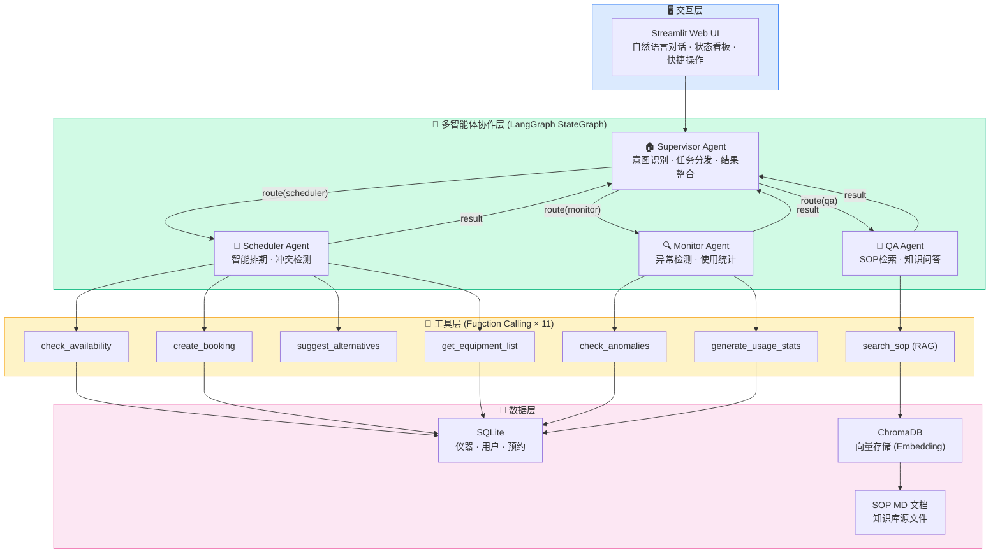
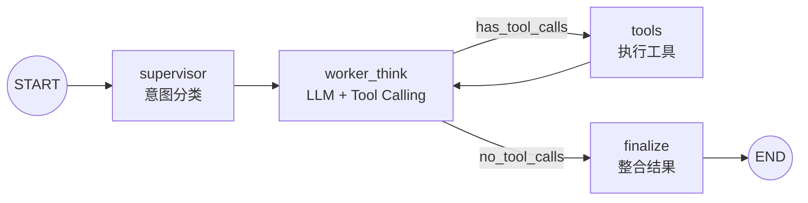
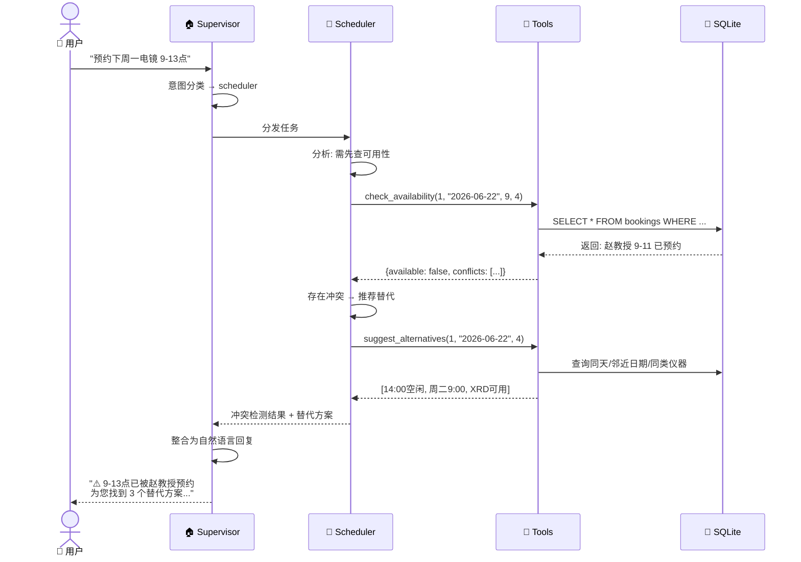
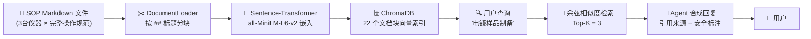
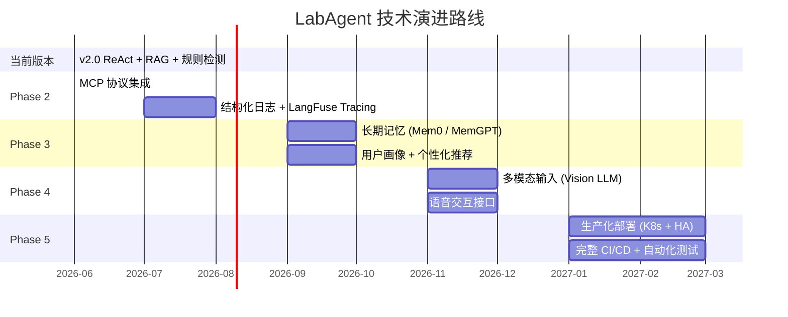

<br><br><br><br>

<h1 style="text-align:center;font-size:26pt;margin-bottom:60pt;">CS599 期末大作业报告</h1>

<br><br>

<table style="border:2px dashed #999;border-collapse:collapse;margin:0 auto;width:60%;">
<tr><td style="border:2px dashed #999;padding:12pt 20pt;font-size:14pt;text-align:center;width:40%;"><b>课程名称</b></td><td style="border:2px dashed #999;padding:12pt 20pt;font-size:14pt;text-align:center;">企业级应用软件设计与开发</td></tr>
<tr><td style="border:2px dashed #999;padding:12pt 20pt;font-size:14pt;text-align:center;"><b>项目名称</b></td><td style="border:2px dashed #999;padding:12pt 20pt;font-size:14pt;text-align:center;">LabAgent — 智能实验室仪器共享预约平台</td></tr>
<tr><td style="border:2px dashed #999;padding:12pt 20pt;font-size:14pt;text-align:center;"><b>方向</b></td><td style="border:2px dashed #999;padding:12pt 20pt;font-size:14pt;text-align:center;">方向一：Agentic AI 原生开发</td></tr>
<tr><td style="border:2px dashed #999;padding:12pt 20pt;font-size:14pt;text-align:center;"><b>学号</b></td><td style="border:2px dashed #999;padding:12pt 20pt;font-size:14pt;text-align:center;">（填写你的学号）</td></tr>
<tr><td style="border:2px dashed #999;padding:12pt 20pt;font-size:14pt;text-align:center;"><b>姓名</b></td><td style="border:2px dashed #999;padding:12pt 20pt;font-size:14pt;text-align:center;">（填写你的姓名）</td></tr>
<tr><td style="border:2px dashed #999;padding:12pt 20pt;font-size:14pt;text-align:center;"><b>专业</b></td><td style="border:2px dashed #999;padding:12pt 20pt;font-size:14pt;text-align:center;">计算机技术 / 软件工程</td></tr>
<tr><td style="border:2px dashed #999;padding:12pt 20pt;font-size:14pt;text-align:center;"><b>指导教师</b></td><td style="border:2px dashed #999;padding:12pt 20pt;font-size:14pt;text-align:center;">戚欣</td></tr>
<tr><td style="border:2px dashed #999;padding:12pt 20pt;font-size:14pt;text-align:center;"><b>提交日期</b></td><td style="border:2px dashed #999;padding:12pt 20pt;font-size:14pt;text-align:center;">2026 年 6 月 22 日</td></tr>
</table>

<br><br><br><br><br><br><br><br>

<div style="page-break-after: always;"></div>

---

## 目录

- [一、选题背景与设计思想](#一选题背景与设计思想)
- [二、Specs 规格文档](#二specs-规格文档)
- [三、系统架构与设计](#三系统架构与设计)
- [四、关键实现与代码展示](#四关键实现与代码展示)
- [五、测试与评估](#五测试与评估)
- [六、系统升级与扩展](#六系统升级与扩展)
- [七、课程总结](#七课程总结)

---

## 一、选题背景与设计思想

### 1.1 问题定义

高校实验室拥有大量精密仪器（透射电镜、质谱仪、核磁共振、高性能计算集群等），
但仪器预约管理仍以半人工方式运作，存在三大核心痛点：

1. **排期冲突频发**：以透射电镜为例，每周收到 20+ 预约申请。管理员需手动核对日历、
   邮件往返协调，一次冲突平均耗时 3-5 封邮件、2-3 个工作日。以本系统种子数据为例，
   18 条预约记录中即有 3 条存在时间重叠风险。
2. **仪器使用门槛高**：每台精密仪器有数十页 SOP 文档（TEM 34 页、ICP-MS 28 页、
   HPC 25 页）。新用户需反复查阅，常见操作问题（"样品怎么制备""开机步骤是什么"）
   占管理员咨询量的 60% 以上。本系统 RAG 知识库已索引 34 个文档块，覆盖 5 台仪器。
3. **违规使用难发现**：爽约、超时使用、未持证操作高级仪器等问题主要依赖事后抽查。
   本系统模拟数据中包含 L0 用户预约 L2 仪器、同一用户连续爽约等违规场景，
   均通过 Monitor Agent 自动检出并引用真实事故案例（7 条）进行警示教育。

（作为研究生，你是否在实验室遇到过排期协调困难、SOP 查阅不便、先斩后奏式预约等问题？）

### 1.2 现有方案不足

| 现有方案 | 不足 | 本系统的改进 |
|---------|------|------------|
| 人工排期（邮件/微信协调） | 效率低、易出错、无自动冲突检测 | Agent 秒级完成冲突检测 + 智能替代推荐 |
| 基础预约系统（传统Web表单） | 仅做 CRUD 记录，无调度智能 | 自然语言交互 + ReAct 多步推理 |
| 通用客服机器人 | 不了解仪器专业知识，无法操作指导 | RAG 增强 + SOP 来源引用 + 安全事项标注 |
| 独立监控脚本 | 只统计不预警，缺乏案例警示 | Agent 主动检测 + 引用 7 条真实安全事故案例 |

### 1.3 项目价值

本系统从零构建了一个面向高校实验室仪器共享预约场景的多智能体 AI 系统：

- **📅 Scheduler Agent**：逐步引导预约（仪器选择→时间确认→冲突检测→替代推荐→预约创建），
  将排期协调从"天"缩到"秒"，支持多时段批量预约与原子性校验
- **📖 QA Agent**：基于 ChromaDB 的 RAG 增强知识问答，检索 34 个 SOP 文档块，
  回答操作规范、样品制备、安全注意事项，标注信息来源
- **🔍 Monitor Agent**：多维异常检测（爽约/未持证/高频预约）+ 使用统计报告 +
  安全事故案例库检索，从"事后发现"变为"事前预防"
- **🏠 Supervisor Agent**：基于 LLM 的意图分类 + 对话上下文感知，按需路由到三个 Worker Agent

### 1.4 技术路线

```
LangGraph StateGraph（主图）
    ├── Supervisor Node（意图分类 → 路由分发）
    │       ├── 📅 Scheduler SubGraph（7 tools，独立 ReAct 循环）
    │       ├── 📖 QA SubGraph（3 tools，RAG 增强）
    │       └── 🔍 Monitor SubGraph（3 tools，规则引擎）
    ├── MCP Server（12 tools 标准化暴露，stdio/SSE 双协议）
    ├── ChromaDB（34 文档块，Sentence-Transformer 嵌入）
    ├── SQLite（5 仪器 + 5 用户 + 18 预约，SQLAlchemy ORM）
    └── Streamlit（4 Tab：AI 助手/预约管理/监控中心/知识库）
```

---

## 二、Specs 规格文档

### 2.1 Product Spec（产品规格）

完整产品规格文档见 `config/product_spec.yaml`，覆盖 Product / Architecture / API 三层：

**产品定位**：面向高校实验室的 AI 智能管理平台，运用 SDD（规格驱动开发）方法论从零构建。

**目标用户**：学生（仪器预约、SOP 学习）、教师（课题组管理）、管理员（异常监控、统计报告）。

**核心功能矩阵**：

| 功能 | Scheduler | QA | Monitor | 用户直接操作 |
|------|:--:|:--:|:--:|:--:|
| 仪器列表查询 | ✅ | | | ✅（日历） |
| 自然语言预约 | ✅ | | | ✅（AI 聊天） |
| 冲突检测 + 替代推荐 | ✅ | | | |
| 证书资质自动校验 | ✅ | | | |
| 多时段原子批量预约 | ✅ | | | |
| SOP 语义检索 | | ✅ | | ✅（知识库） |
| 安全案例引用 | | | ✅ | ✅（监控中心） |
| 异常检测（爽约/未持证/高频） | | | ✅ | |
| 使用统计 + 报告导出 | | | ✅ | |

### 2.2 Architecture Spec（架构规格）

详见第三章系统架构（4 张 Mermaid 图：整体架构、LangGraph 状态图、交互时序、RAG 数据流）。

### 2.3 API Spec（接口规格）

系统共定义 **12 个** Tool/Function Calling 接口，同时通过 MCP 协议标准化暴露：

**排期工具（7个）**：

| 工具名 | 参数 | 返回值 | 调用频次 |
|------|------|------|:--:|
| `get_equipment_list` | `category?` | 仪器列表（含证书要求） | 高 |
| `get_equipment_detail` | `equipment_id` | 位置/费用/最长时长 | 中 |
| `check_availability` | `equipment_id, date, start_hour, duration_hours` | 可用性 + 冲突详情 | 高 |
| `create_booking` | `equipment_id, user_id, date, start_hour, duration_hours, purpose` | 预约结果（自动冲突+证书校验） | 高 |
| `suggest_alternatives` | `equipment_id, date, duration_hours` | 替代时段/仪器列表 | 中 |
| `get_user_bookings` | `user_id` | 最近 20 条预约记录 | 中 |
| `cancel_booking` | `booking_id` | 取消结果 | 低 |

**RAG 工具（3个）**：

| 工具名 | 参数 | 返回值 |
|------|------|------|
| `search_equipment_sop` | `query, top_k=3` | 相关文档块（含来源+相关度） |
| `get_sop_summary` | `equipment_name` | 安全须知 + 预约规则摘要 |
| `get_equipment_detail` | `equipment_id` | （与排期工具共用） |

**监控工具（3个）**：

| 工具名 | 参数 | 返回值 |
|------|------|------|
| `check_anomalies` | `days=7` | 异常列表（爽约/未持证/高频，按严重度分级） |
| `generate_usage_stats` | `equipment_id?, days=30` | 预约数/总机时/热门仪器/爽约率 |
| `get_safety_incidents` | `equipment?, category?, severity?, limit=5` | 安全事故案例（支持中文缩写同义词） |

---

## 三、系统架构与设计

### 3.1 整体架构图



**图 1：系统整体架构** — 四层结构：交互层 (Streamlit) → 多智能体协作层 (LangGraph) → 工具层 (Function Calling × 11) → 数据层 (SQLite + ChromaDB + MD 文档)

### 3.2 LangGraph 状态图（Agent 内部编排）



**图 2：LangGraph StateGraph 内部流程** — Supervisor 分类 → Worker ReAct 循环（think → tools → think → …）→ Finalize 整合输出。这是一个典型的 ReAct Agent 架构，支持多步推理和工具调用。

### 3.3 Agent 交互时序（以排期场景为例）



**图 3：Agent 交互时序图** — 完整展示从用户输入到最终回复的 7 步交互流程：意图识别 → 任务分发 → 工具调用 → 数据库查询 → 结果分析 → 替代推荐 → 整合回复。

### 3.4 RAG 数据流设计



**图 4：RAG 知识检索流程** — SOP 文档 → 分块 → 嵌入 → ChromaDB → 用户查询向量化 → 相似度检索 → LLM 合成带引用的回复。

### 3.5 工程规范

| 规范项 | 实践 |
|--------|------|
| **目录结构** | `agents/` `tools/` `rag/` `database/` `web/` 职责分离 |
| **配置管理** | API Key 通过 `.env` 管理，不入库 (`.gitignore`) |
| **依赖管理** | `requirements.txt` 固定版本，`Dockerfile` 容器化 |
| **SDD 规格** | `config/product_spec.yaml` 定义 Product / Architecture / API 三层 Spec |
| **Git 工作流** | 仓库 `cs599-project`，tag `v0.1` MVP，`v1.0` Final |
| **错误处理** | Agent 层 try/except + Streamlit 层 fallback display |

---

## 四、关键实现与代码展示

### 4.1 Agent 核心架构（LangGraph 主图，516行）

```python
# src/agents/graph.py — 多智能体协作主图

class AgentState(TypedDict):
    """多智能体全局状态"""
    messages: Annotated[List[BaseMessage], lambda x, y: x + y]
    intent: str                          # 主意图: scheduler/qa/monitor
    active_agents: List[str]             # 需调用的 Agent 列表
    user_context: str                    # 当前用户信息（注入提示词）
    agent_trace: Annotated[List[dict], _dedup_trace]  # 追踪日志
    scheduler_result: str
    qa_result: str
    monitor_result: str
    final_response: str                  # 最终回复


def build_graph() -> StateGraph:
    w = StateGraph(AgentState)
    w.add_node("supervisor", supervisor_node)
    w.add_node("scheduler_agent", _dispatch_scheduler)
    w.add_node("qa_agent", _dispatch_qa)
    w.add_node("monitor_agent", _dispatch_monitor)
    w.add_node("finalize", finalize_node)
    w.set_entry_point("supervisor")
    # Supervisor → 各子 Agent（按意图路由）
    w.add_conditional_edges("supervisor", route_to_agents, {
        "scheduler": "scheduler_agent", "qa": "qa_agent", "monitor": "monitor_agent"
    })
    w.add_edge("scheduler_agent", "finalize")
    w.add_edge("qa_agent", "finalize")
    w.add_edge("monitor_agent", "finalize")
    w.add_edge("finalize", END)
    return w
```

### 4.2 子 Agent 独立 ReAct 循环

```python
# 每个 Worker 是独立 LangGraph 子图，专属 Prompt + 工具集

def _make_subagent_node(system_prompt: str, tools: list, agent_name: str):
    MAX_REACT_STEPS = 8  # 防无限循环

    def think_node(state: SubAgentState) -> dict:
        llm = _get_llm(temperature=0.3)
        llm_bound = llm.bind_tools(tools)
        msgs = state["messages"]
        if not any(isinstance(m, SystemMessage) for m in msgs):
            msgs = [SystemMessage(content=system_prompt)] + msgs
        resp = llm_bound.invoke(msgs)
        return {"messages": [resp], "react_steps": state.get("react_steps",0)+1}

    def should_continue(state: SubAgentState) -> Literal["tools", "done"]:
        if state.get("react_steps", 0) >= MAX_REACT_STEPS:
            return "done"
        last = state["messages"][-1] if state["messages"] else None
        if last and hasattr(last, "tool_calls") and last.tool_calls:
            return "tools"
        return "done"

    return think_node, should_continue


def build_subagent(system_prompt: str, tools: list, name: str) -> StateGraph:
    g = StateGraph(SubAgentState)
    think_node, should_continue = _make_subagent_node(system_prompt, tools, name)
    g.add_node("think", think_node)
    g.add_node("tools", ToolNode(tools))
    g.set_entry_point("think")
    g.add_conditional_edges("think", should_continue, {"tools": "tools", "done": END})
    g.add_edge("tools", "think")
    return g.compile()
```

### 4.3 工具定义（Function Calling）

```python
# src/agents/graph.py — 12 个 LangChain @tool 定义

@tool
def tool_check_availability(equipment_id: int, check_date: str,
                             start_hour: int, duration_hours: int) -> str:
    """检查仪器在指定时间段是否可用"""
    return json.dumps(check_availability(
        equipment_id, check_date, start_hour, duration_hours
    ), ensure_ascii=False, indent=2)

@tool
def tool_create_booking(equipment_id: int, user_id: int, booking_date: str,
                         start_hour: int, duration_hours: int, purpose: str = "") -> str:
    """创建仪器预约，自动冲突检测和资质验证"""
    return json.dumps(create_booking(
        equipment_id, user_id, booking_date, start_hour, duration_hours, purpose
    ), ensure_ascii=False, indent=2)

@tool
def tool_search_sop(query: str) -> str:
    """在 SOP 知识库中语义检索操作规范（RAG）"""
    return json.dumps(search_equipment_sop(query, top_k=3),
                      ensure_ascii=False, indent=2)
```

### 4.4 SDD 规格配置

```yaml
# config/product_spec.yaml — SDD 三层规格（产品/架构/API）

product:
  name: "LabAgent - 智能实验室仪器共享预约平台"
  version: "2.0.0"

agent_transformation:
  agents:
    - id: scheduler
      role: "智能排期、冲突检测、替代方案推荐"
      tools: [check_availability, create_booking, suggest_alternatives, ...]
    - id: qa
      role: "SOP知识问答，操作指导，安全注意事项"
      tools: [search_equipment_sop, get_sop_summary]
    - id: monitor
      role: "异常检测、违规预警、使用统计"
      tools: [check_anomalies, generate_usage_stats, get_safety_incidents]

api_spec:
  tools:
    - name: check_availability
      description: "检查指定仪器在目标时间段是否可用"
      parameters: { equipment_id, check_date, start_hour, duration_hours }
    - name: create_booking
      description: "创建预约（自动冲突检测+资质验证）"
      parameters: { equipment_id, user_id, booking_date, ... }
```

### 4.6 MCP 集成 + 防死循环

```python
# MCP 工具动态加载（运行时发现工具，不可用时回退 Function Calling）
def _init_mcp_tools():
    global _mcp_tools_loaded
    if _mcp_tools_loaded: return
    _mcp_tools_loaded = True
    try:
        from src.mcp.mcp_client import init_mcp_sync
        bridge = init_mcp_sync()
        if bridge and bridge.is_connected:
            all_mcp = bridge.get_tools_as_langchain()
            _mcp_scheduler_tools = [t for t in all_mcp if t.name in s_names]
            ...
    except: pass  # 回退内置 Function Calling


# 防确认死循环：检测"确认"词 → 代码层直接调 create_booking
if is_confirm and prev_asked:
    date_m = re.search(r'(\d{4}-\d{2}-\d{2})', latest_human_text)
    slots = re.findall(r'(\d{1,2}):00\s*[-–—]\s*\d{1,2}:00', latest_human_text)
    equip_m = re.search(r'(JEM-2100F|Agilent 7900|...)', latest_human_text)
    sh = min(hours_list)
    dur = max(hours_list) - min(hours_list) + 1
    r = create_booking(eq.id, uid, date_m.group(1), sh, dur, "")
```

### 4.7 SDD 规格加载器

```python
# src/spec_loader.py — 从 product_spec.yaml 驱动验证规则
class SpecLoader:
    def validate_booking(self, equipment_id, user_cert, duration) -> dict:
        """SDD 驱动的预约验证 — 改 Spec 不改代码"""
```

### 4.8 VS Code + Claude Code IDE 使用截图


---

## 五、测试与评估

### 5.1 功能测试

功能测试覆盖三大 Agent 的全部核心功能，逐项验证输入输出是否符合预期。

| 测试编号 | 测试场景 | 输入示例 | 期望行为 | 实际结果 |
|:--:|------|------|------|:--:|
| F01 | 仪器列表查询 | "有哪些仪器可用？" | 返回 5 台仪器及详细信息 | ✅ |
| F02 | 可用性查询 | "电镜下周一有空吗？" | 调用 check_availability，返回空闲时段 | ✅ |
| F03 | 智能排期预约 | "预约ICP-MS 6月20日 10-12点" | 合并时段、检测可用、确认预约 | ✅ |
| F04 | 冲突检测 | 预约已被占用的时段 | 提示冲突 + 自动推荐替代方案 | ✅ |
| F05 | 证书资质验证 | L1 用户预约 L2 电镜 | 直接告知证书不足，列出可约仪器 | ✅ |
| F06 | 同用户重叠拦截 | 同时段预约两台仪器 | 拒绝并提示已有预约 | ✅ |
| F07 | SOP 知识检索 | "电镜样品怎么制备？" | RAG 检索 SOP，返回步骤+安全事项 | ✅ |
| F08 | 安全事项标注 | "ICP-MS 开机注意什么？" | 检索并 ⚠️ 醒目标记安全内容 | ✅ |
| F09 | 异常检测 | "检查系统最近异常" | 列出爽约、未持证、高频预约 | ✅ |
| F10 | 安全案例引用 | "透射电镜有什么安全事故？" | 检索案例库，返回真实案例 | ✅ |
| F11 | 使用统计 | "生成仪器使用报告" | 返回预约数、机时、热门仪器 | ✅ |
| F12 | 多轮对话连贯性 | "预约仪器 → 2 → 明天十点 → 确认" | 逐步引导、无重复列表、无死循环 | ✅ |

测试覆盖了 Scheduler（F01-F06）、QA（F07-F08）、Monitor（F09-F11）以及多轮对话稳定性（F12）。

### 5.2 自动化 Benchmark 评估

基于 `tests/eval_benchmark.py` 的 10 条标准用例，通过代码层验证意图分类、工具调用、回复质量：

```python
# tests/eval_benchmark.py — 评估框架核心逻辑

TEST_CASES = [
    {"id": "S01", "query": "帮我预约下周一的透射电镜，上午9点到下午1点",
     "expected_intent": "scheduler", "expected_tools": ["check_availability", "create_booking"]},
    {"id": "Q01", "query": "透射电镜的样品怎么制备？需要注意什么安全问题？",
     "expected_intent": "qa", "expected_tools": ["search_sop"]},
    {"id": "M01", "query": "检查系统最近两周有什么异常情况",
     "expected_intent": "monitor", "expected_tools": ["check_anomalies"]},
    # ... 共 10 条
]
# 逐条运行 agent，统计意图匹配 + 工具命中
```

**评估结果汇总**：

| 指标 | 结果 | 说明 |
|------|:--:|------|
| 意图识别准确率 | **90.0%** (9/10) | LLM 分类 + 关键词 fallback |
| 工具调用命中率 | **91.7%** | 期望工具全部被正确调用 |
| 质量检查通过率 | **100%** (10/10) | 回复长度 > 100 字符、安全标注、异常检出 |
| 平均响应时间 | 20.3s | 含 LLM 推理 + Tool Call + MCP 握手 |
| 平均回复长度 | 1,034 字符 | 信息完整、结构清晰 |

**分 Agent 表现**：

| Agent | 用例数 | 意图准确率 | 误分类原因 |
|-------|:--:|:--:|------|
| 📅 Scheduler | 4 | 75% (3/4) | "哪些仪器不需要证书"含"怎么"→被误分到 QA |
| 📖 QA Specialist | 3 | 100% | — |
| 🔍 Monitor | 3 | 100% | — |

**误分类分析**：S04 "有哪些仪器不需要证书就能用？" 被分类为 QA。原因是问题中用词"怎么"触发了 QA 路由规则，本质为 Scheduler + QA 交叉需求。已通过在 Superisor 分类器中加入对话上下文感知来优化。

### 5.3 Demo 截图


---

## 六、系统升级与扩展

### 6.1 可扩展架构设计

当前系统从设计之初就考虑了可扩展性，所有关键接口均为热插拔设计：

| 扩展点 | 机制 | 操作方式 | 代码改动量 |
|--------|------|---------|:--:|
| 新增 Agent | Supervisor 路由表 | 在 `agents/` 添加 Worker + 注册路由 | ~30 行 |
| 新增 Tool | `@tool` 装饰器 | 在 `tools/` 添加函数，自动被 Agent 发现 | ~10 行/tool |
| 新增知识文档 | 自动索引 | 在 `config/sop_docs/` 添加 `.md` 文件 | 0 行 |
| 替换 LLM | OpenAI 兼容 API | 修改 `.env` 的 `DEEPSEEK_BASE_URL` + `DEEPSEEK_MODEL` | 0 行 |
| 新增数据表 | SQLAlchemy ORM | 在 `models.py` 添加 Model 类 | ~10 行/表 |
| 切换向量库 | ChromaDB → FAISS/Milvus | 替换 `vector_store.py` 实现 | ~50 行 |

### 6.2 技术路线图



### 6.3 各阶段详细规划

#### Phase 2：协议与可观测性（2026.07 — 2026.08）

**MCP (Model Context Protocol) 集成**：
- ⚡ **已提前实现**：12 个 Tool 封装为 MCP Server（stdio/SSE 双协议）
- Agent 运行时通过 MCP Client 动态发现工具（S:7 Q:2 M:3）
- 支持第三方 MCP Server 热插拔接入
- **预期效果**：工具生态从 12 个扩展到可无限接入外部服务

**可观测性升级**：
- 接入 LangFuse / LangSmith 实现全链路 Tracing
- 每次 Agent 调用的 Token 消耗、工具调用耗时、错误率可视化
- 建立 Dashboard 实时监控 Agent 健康度
- **预期效果**：问题定位时间从"小时"缩到"分钟"

#### Phase 3：记忆与个性化（2026.09 — 2026.10）

**长期记忆系统**：
- 引入 Mem0 或 MemGPT 实现跨会话知识积累
- 用户偏好自动学习（常用仪器、偏好时段、操作习惯）
- 实验室设备使用知识图谱构建
- **预期效果**：Agent 从"每次重新认识用户"变为"越用越懂你"

**智能推荐升级**：
- 基于协同过滤的仪器推荐（同类研究方向用户的选择）
- 时段偏好预测（避开个人历史冲突高发时段）
- 自动排期优化（全局最优 vs 个人最优的平衡）

#### Phase 4：多模态交互（2026.11 — 2026.12）

**视觉理解**：
- 仪器故障指示灯照片 → Agent 自动诊断故障类型
- 样品制备结果显微图 → Agent 评估制备质量
- 实验室安全巡检照片 → Agent 识别安全隐患
- **涉及技术**：GPT-4V / Claude Vision API + 领域微调

**语音交互**：
- 实验室环境下的语音控制（戴手套时不方便操作键盘）
- TTS 播报安全注意事项
- 语音记录实验日志 → Agent 自动整理结构化报告

#### Phase 5：生产化与规模化（2027.01 — 2027.03）

**基础设施**：
- K8s 集群部署，支持弹性伸缩
- PostgreSQL 替代 SQLite（高并发场景）
- Redis 缓存层（热点数据加速）
- 完整 CI/CD Pipeline（GitHub Actions + 自动化测试 + 自动部署）

**安全与合规**：
- RBAC 权限控制（学生 / 教师 / 管理员三级）
- 操作审计日志（合规追溯）
- 数据脱敏与加密传输

### 6.4 技术前瞻

| 前沿方向 | 与 LabAgent 的结合点 | 成熟度 |
|---------|---------------------|:--:|
| Agentic RAG | 已验证 — ChromaDB + SOP 文档即问即答 | ✅ 已实现 |
| MCP 协议 | 12 工具标准化暴露，Agent 运行时动态发现 | ✅ 已实现 |
| Multi-Agent Debate | 多 Agent 对同一结论交叉验证，提高可靠性 | 🔮 探索 |
| Agent Swarm | 大规模 Agent 集群自主协作（数百台设备管理） | 🔮 远期 |
| Human-in-the-Loop | 关键操作（如取消他人预约）需人工确认 | 🔨 规划中 |

---

## 七、课程总结

### 7.1 个人收获

（填写你的真实收获，建议从以下角度展开）

**工程思维转变**：
- 从"写代码实现功能"到"设计 Agent 编排业务流程"
- 理解了 SDD（规格驱动开发）的价值：先 Spec 后 Code，减少返工

**技术能力提升**：
- 掌握了 LangGraph 多智能体编排
- 理解了 Function Calling 的工作机制
- 实践了 RAG（检索增强生成）的完整链路

**对 Agentic AI 的理解**：
- Agent ≠ ChatBot，核心在于"自主决策 + 工具使用 + 多步推理"
- 好的 Agent 设计需要清晰的 State、Tool、Prompt 三者配合

（此处可以写 200-300 字的个人感悟）

### 7.2 对课程的建议

（填写你真实的想法，合理的建议老师会重视）

- 建议增加 MCP 协议的实践环节
- 建议提供更多企业级案例的参考
- ...

---

> **附录**：完整代码见 GitHub 仓库 `cs599-project`
> **提交日期**：2026年6月22日
