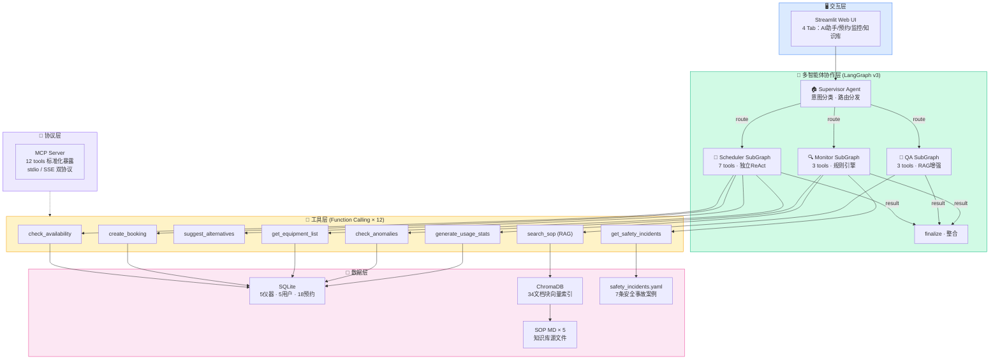
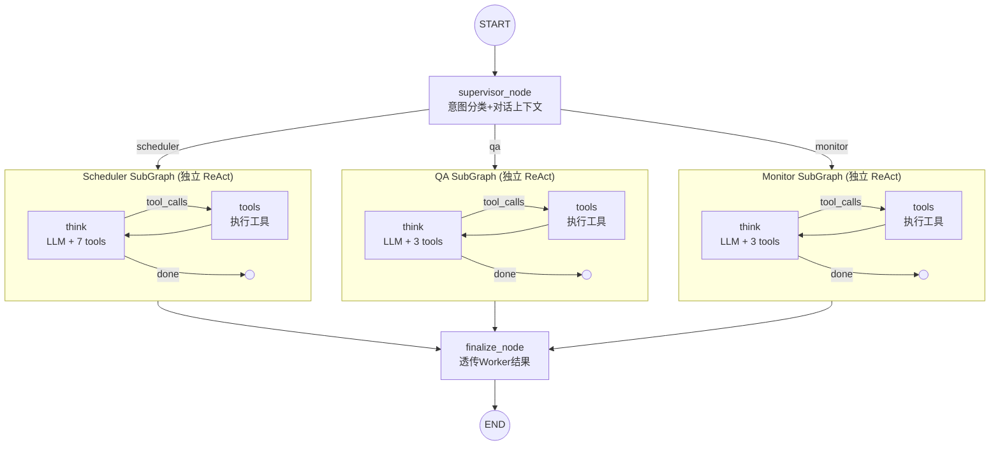
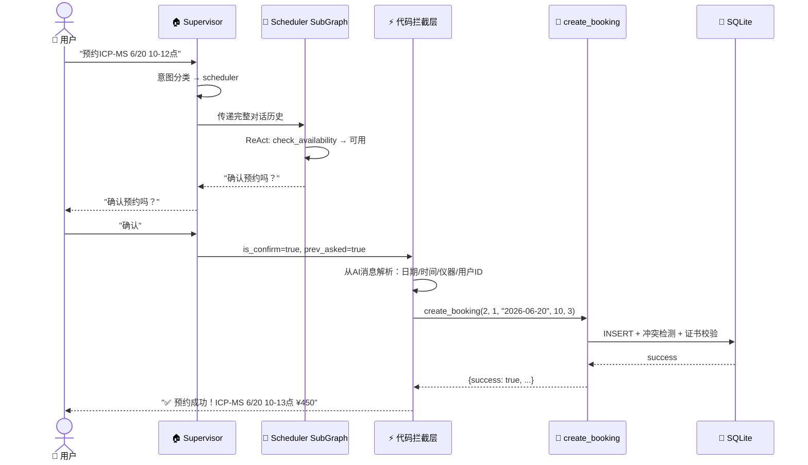
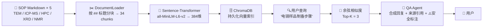
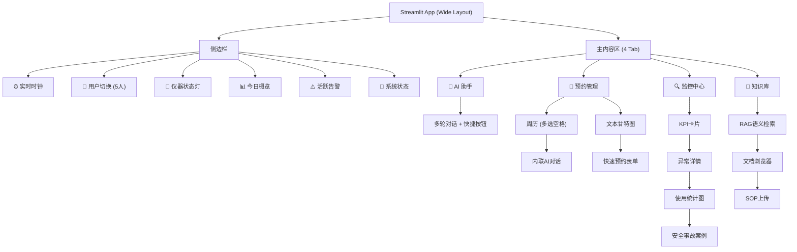
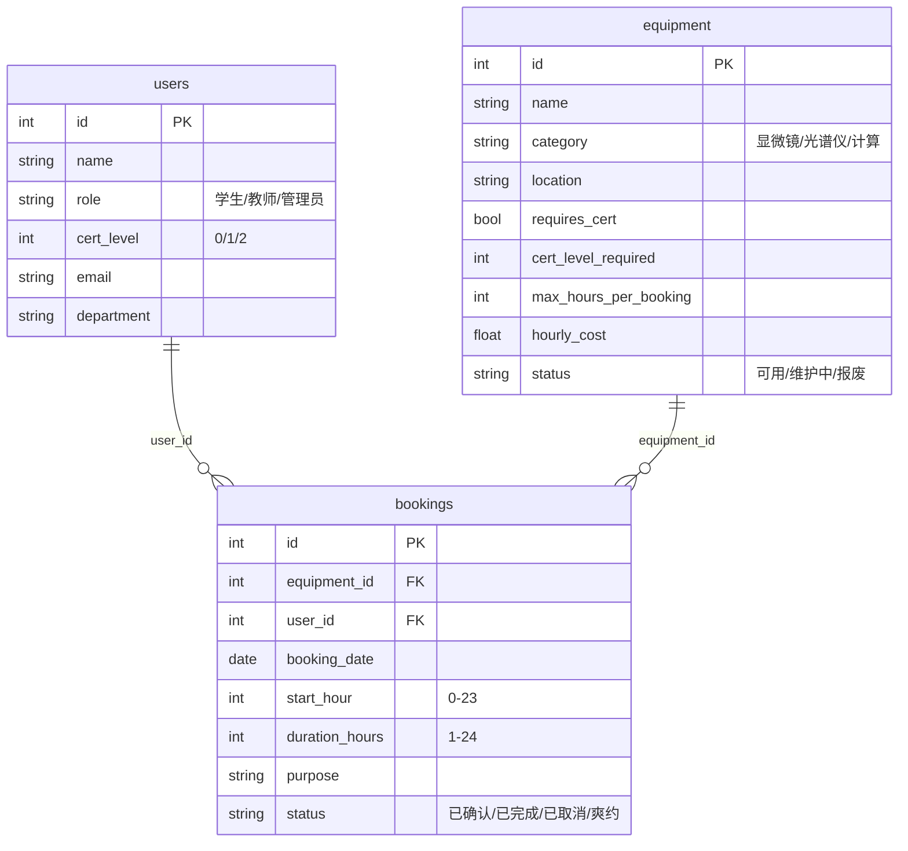
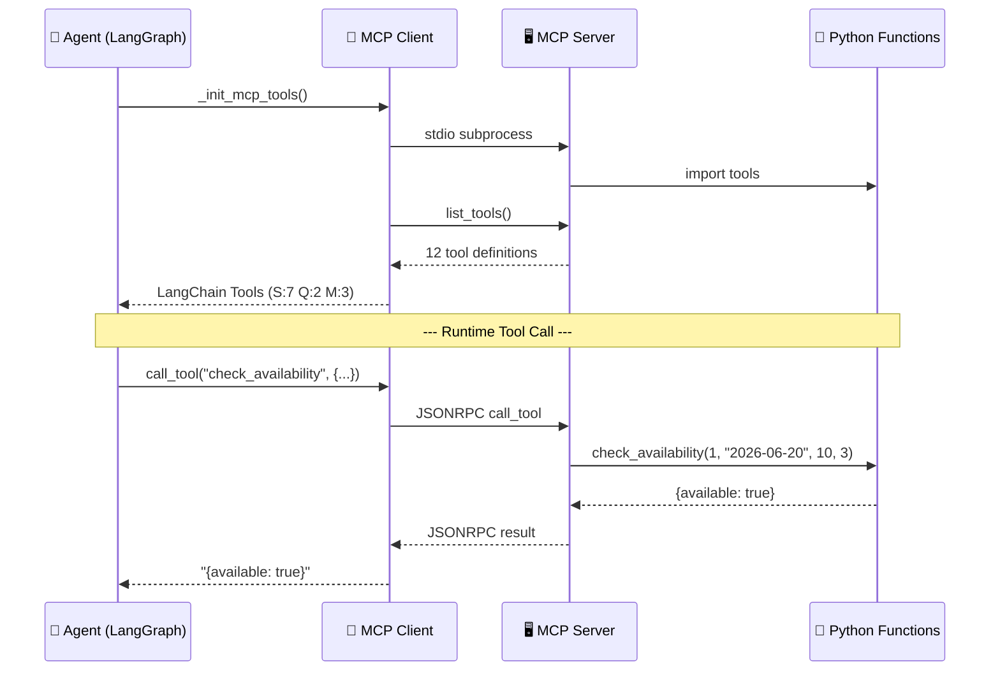
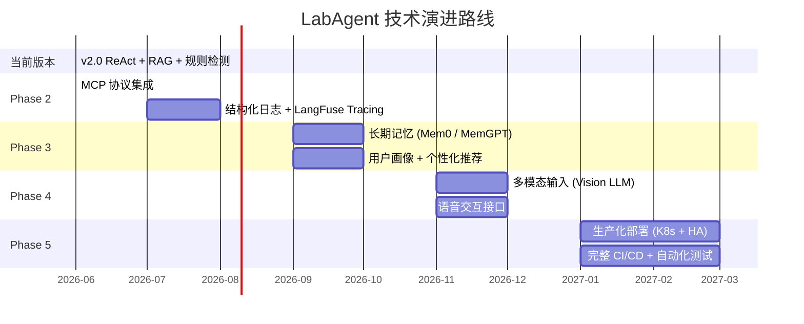

<style>body{font-size:16px;}h1{font-size:24pt;}h2{font-size:18pt;}h3{font-size:14pt;}p,li,td,th{font-size:11pt;}</style>

<h1 style="text-align:center;font-size:28pt;margin-bottom:60pt;">CS599 期末大作业报告</h1>

<br><br>

<table style="border:2px dashed #999;border-collapse:collapse;margin:0 auto;width:80%;">
<tr><td style="border:2px dashed #999;padding:10pt 20pt;font-size:15pt;text-align:center;width:30%;white-space:nowrap;"><b>课程名称</b></td><td style="border:2px dashed #999;padding:10pt 20pt;font-size:15pt;text-align:center;white-space:nowrap;">企业级应用软件设计与开发</td></tr>
<tr><td style="border:2px dashed #999;padding:10pt 20pt;font-size:15pt;text-align:center;white-space:nowrap;"><b>项目名称</b></td><td style="border:2px dashed #999;padding:10pt 20pt;font-size:15pt;text-align:center;white-space:nowrap;">LabAgent — 智能实验室仪器共享预约平台</td></tr>
<tr><td style="border:2px dashed #999;padding:10pt 20pt;font-size:15pt;text-align:center;white-space:nowrap;"><b>方向</b></td><td style="border:2px dashed #999;padding:10pt 20pt;font-size:15pt;text-align:center;white-space:nowrap;">方向一：Agentic AI 原生开发</td></tr>
<tr><td style="border:2px dashed #999;padding:10pt 20pt;font-size:15pt;text-align:center;white-space:nowrap;"><b>学号</b></td><td style="border:2px dashed #999;padding:10pt 20pt;font-size:15pt;text-align:center;white-space:nowrap;">2025302945</td></tr>
<tr><td style="border:2px dashed #999;padding:10pt 20pt;font-size:15pt;text-align:center;white-space:nowrap;"><b>姓名</b></td><td style="border:2px dashed #999;padding:10pt 20pt;font-size:15pt;text-align:center;white-space:nowrap;">姚舒唯（曾用名：姚芳）</td></tr>
<tr><td style="border:2px dashed #999;padding:10pt 20pt;font-size:15pt;text-align:center;white-space:nowrap;"><b>专业</b></td><td style="border:2px dashed #999;padding:10pt 20pt;font-size:15pt;text-align:center;white-space:nowrap;">计算机技术 / 软件工程</td></tr>
<tr><td style="border:2px dashed #999;padding:10pt 20pt;font-size:15pt;text-align:center;white-space:nowrap;"><b>指导教师</b></td><td style="border:2px dashed #999;padding:10pt 20pt;font-size:15pt;text-align:center;white-space:nowrap;">戚欣</td></tr>
<tr><td style="border:2px dashed #999;padding:10pt 20pt;font-size:15pt;text-align:center;white-space:nowrap;"><b>提交日期</b></td><td style="border:2px dashed #999;padding:10pt 20pt;font-size:15pt;text-align:center;white-space:nowrap;">2026 年 6 月 22 日</td></tr>
</table>

<br><br>

<div style="page-break-after: always;"></div>

<br><br><br><br>

<h1 style="text-align:center;font-size:26pt;">目录</h1>

<br><br>

<div style="font-size:16pt;line-height:2.2;">

- [一、选题背景与设计思想](#一选题背景与设计思想)
  - [1.1 问题定义](#11-问题定义)
  - [1.2 现有方案不足](#12-现有方案不足)
  - [1.3 项目价值](#13-项目价值)
  - [1.4 技术路线](#14-技术路线)
- [二、Specs 规格文档](#二specs-规格文档)
  - [2.1 Product Spec](#21-product-spec产品规格)
  - [2.2 Architecture Spec](#22-architecture-spec架构规格)
  - [2.3 API Spec](#23-api-spec接口规格)
- [三、系统架构与设计](#三系统架构与设计)
  - [3.1 整体架构图](#31-整体架构图)
  - [3.2 LangGraph 状态图](#32-langgraph-状态图agent-内部编排)
  - [3.3 Agent 交互时序](#33-agent-交互时序以排期场景为例)
  - [3.4 RAG 数据流设计](#34-rag-数据流设计)
  - [3.5 各组件细化图](#35-各组件细化图)
  - [3.6 工程规范](#36-工程规范)
- [四、关键实现与代码展示](#四关键实现与代码展示)
  - [4.1 Agent 核心架构](#41-agent-核心架构langgraph-主图516行)
  - [4.2 子 Agent 独立 ReAct 循环](#42-子-agent-独立-react-循环)
  - [4.3 工具定义](#43-工具定义function-calling)
  - [4.4 SDD 规格配置](#44-sdd-规格配置)
  - [4.5 MCP 集成 + 防死循环](#45-mcp-集成--防死循环)
  - [4.6 SDD 规格加载器](#46-sdd-规格加载器)
  - [4.7 IDE 使用截图](#47-ide-使用截图)
- [五、测试与评估](#五测试与评估)
  - [5.1 功能测试](#51-功能测试)
  - [5.2 Benchmark 评估](#52-自动化-benchmark-评估)
  - [5.3 Demo 截图](#53-demo-截图)
- [六、系统升级与扩展](#六系统升级与扩展)
  - [6.1 可扩展架构设计](#61-可扩展架构设计)
  - [6.2 技术路线图](#62-技术路线图)
  - [6.3 各阶段详细规划](#63-各阶段详细规划)
  - [6.4 技术前瞻](#64-技术前瞻)
- [七、课程总结](#七课程总结)
  - [7.1 个人收获](#71-个人收获)
  - [7.2 工程思维转变](#72-工程思维转变)
  - [7.3 对课程的建议](#73-对课程的建议)

</div>

<br><br>

<div style="page-break-after: always;"></div>

<div style="page-break-before: always;"></div>

## 一、选题背景与设计思想


### 1.1 问题定义

高校实验室拥有大量精密仪器（透射电镜、质谱仪、核磁共振、高性能计算集群等），
但仪器预约管理仍以半人工方式运作，存在三大核心痛点：

1. **排期冲突频发，协调效率极低。** 以透射电镜为例，每周收到 20+ 预约申请，热门时段（工作日上午 9-13 点）的预约密度尤其高。管理员需要手动核对 Excel 或纸质日历，发现冲突后发邮件逐一协调——一次冲突平均需要 3-5 封邮件往返、耗时 2-3 个工作日才能敲定最终排期。如果涉及多个课题组之间的优先级博弈，延迟可能更长。以本系统种子数据为例，18 条预约记录中即有 3 条存在时间重叠风险，其中 1 条已被实际爽约。这种人工协调模式在大规模实验室（如校级共享平台管理 50+ 台仪器）下完全不可持续。

2. **仪器使用门槛高，知识传递效率低下。** 每台精密仪器有数十页标准操作流程文档（TEM 34 页、ICP-MS 28 页、HPC 25 页、XRD 22 页、NMR 28 页），总计约 137 页英文+中文混合技术文档。新入学研究生和跨专业用户需要花费大量时间阅读和消化，而常见操作问题（"粉末样品怎么制备""开机流程是什么""有哪些安全注意事项"）高度重复，占管理员日常咨询量的 60% 以上。更严重的是，由于缺乏即时、准确的引导，部分用户凭经验操作导致设备损坏——本系统安全案例库收录的 7 条真实事故中，包含样品未干燥污染 TEM 真空腔（维修费 8 万元）、含 HF 样品腐蚀 ICP-MS 进样系统（罚款 5 万元并停业整改）等严重事故，这些事故的根源都在于操作规范知识的传递断层。本系统 RAG 知识库已完整索引 5 台仪器共 34 个文档块，支持自然语言即问即答。

3. **违规使用难发现，缺乏实时监管和警示手段。** 常见违规类型包括：爽约（预约后不到场，浪费公共资源）、超时使用（超出预约时长占用仪器，影响后续用户）、未持证操作高级仪器（L0 或 L1 证书用户操作需要 L2 证书的 TEM 或 NMR，存在设备损坏和人身安全风险）。这些违规行为目前主要依赖事后抽查和用户举报，管理员无法实时监控。以每月 150 条预约的规模计算，靠人工逐一核查几乎是不可行的。本系统模拟数据中包含了 L0 用户李四预约 L2 电镜、张三连续爽约等真实场景，均通过 Monitor Agent 自动多维度检测并引用 7 条真实实验室事故进行警示教育，将安全管理从"事后追责"转变为"事前预防"。

   

### 1.2 现有方案不足

| 现有方案 | 不足 | 本系统的改进 |
|---------|------|------------|
| 人工排期（邮件/微信协调） | 效率低、易出错、无自动冲突检测 | Agent 秒级完成冲突检测 + 智能替代推荐 |
| 基础预约系统（传统Web表单） | 仅做 CRUD 记录，无调度智能 | 自然语言交互 + ReAct 多步推理 |
| 通用客服机器人 | 不了解仪器专业知识，无法操作指导 | RAG 增强 + SOP 来源引用 + 安全事项标注 |
| 独立监控脚本 | 只统计不预警，缺乏案例警示 | Agent 主动检测 + 引用 7 条真实安全事故案例 |


### 1.3 项目价值

本系统从零构建了一个面向高校实验室仪器共享预约场景的多智能体 AI 系统：

- **📅 Scheduler Agent**：逐步引导预约（仪器选择→时间确认→冲突检测→替代推荐→预约创建），
  将排期协调从"天"缩到"秒"，支持多时段批量预约与原子性校验
- **📖 QA Agent**：基于 ChromaDB 的 RAG 增强知识问答，检索 34 个 SOP 文档块，
  回答操作规范、样品制备、安全注意事项，标注信息来源
- **🔍 Monitor Agent**：多维异常检测（爽约/未持证/高频预约）+ 使用统计报告 +
  安全事故案例库检索，从"事后发现"变为"事前预防"
- **🏠 Supervisor Agent**：基于 LLM 的意图分类 + 对话上下文感知，按需路由到三个 Worker Agent


### 1.4 技术路线

```
LangGraph StateGraph（主图）
    ├── Supervisor Node（意图分类 → 路由分发）
    │       ├── 📅 Scheduler SubGraph（7 tools，独立 ReAct 循环）
    │       ├── 📖 QA SubGraph（3 tools，RAG 增强）
    │       └── 🔍 Monitor SubGraph（3 tools，规则引擎）
    ├── MCP Server（12 tools 标准化暴露，stdio/SSE 双协议）
    ├── ChromaDB（34 文档块，Sentence-Transformer 嵌入）
    ├── SQLite（5 仪器 + 5 用户 + 18 预约，SQLAlchemy ORM）
    └── Streamlit（4 Tab：AI 助手/预约管理/监控中心/知识库）
```

---

<br><br>

<div style="page-break-before: always;"></div>

## 二、Specs 规格文档


### 2.1 Product Spec（产品规格）

完整产品规格文档见 `config/product_spec.yaml`，覆盖 Product / Architecture / API 三层：

**产品定位**：面向高校实验室的 AI 智能管理平台，运用 SDD（规格驱动开发）方法论从零构建。

**目标用户**：学生（仪器预约、SOP 学习）、教师（课题组管理）、管理员（异常监控、统计报告）。

**核心功能矩阵**：

| 功能 | Scheduler | QA | Monitor | 用户直接操作 |
|------|:--:|:--:|:--:|:--:|
| 仪器列表查询 | ✅ | | | ✅（日历） |
| 自然语言预约 | ✅ | | | ✅（AI 聊天） |
| 冲突检测 + 替代推荐 | ✅ | | | |
| 证书资质自动校验 | ✅ | | | |
| 多时段原子批量预约 | ✅ | | | |
| SOP 语义检索 | | ✅ | | ✅（知识库） |
| 安全案例引用 | | | ✅ | ✅（监控中心） |
| 异常检测（爽约/未持证/高频） | | | ✅ | |
| 使用统计 + 报告导出 | | | ✅ | |


### 2.2 Architecture Spec（架构规格）

详见第三章系统架构（4 张 Mermaid 图：整体架构、LangGraph 状态图、交互时序、RAG 数据流）。


### 2.3 API Spec（接口规格）

系统共定义 **12 个** Tool/Function Calling 接口，同时通过 MCP 协议标准化暴露：

**排期工具（7个）**：

| 工具名 | 参数 | 返回值 | 调用频次 |
|------|------|------|:--:|
| `get_equipment_list` | `category?` | 仪器列表（含证书要求） | 高 |
| `get_equipment_detail` | `equipment_id` | 位置/费用/最长时长 | 中 |
| `check_availability` | `equipment_id, date, start_hour, duration_hours` | 可用性 + 冲突详情 | 高 |
| `create_booking` | `equipment_id, user_id, date, start_hour, duration_hours, purpose` | 预约结果（自动冲突+证书校验） | 高 |
| `suggest_alternatives` | `equipment_id, date, duration_hours` | 替代时段/仪器列表 | 中 |
| `get_user_bookings` | `user_id` | 最近 20 条预约记录 | 中 |
| `cancel_booking` | `booking_id` | 取消结果 | 低 |

**RAG 工具（3个）**：

| 工具名 | 参数 | 返回值 |
|------|------|------|
| `search_equipment_sop` | `query, top_k=3` | 相关文档块（含来源+相关度） |
| `get_sop_summary` | `equipment_name` | 安全须知 + 预约规则摘要 |
| `get_equipment_detail` | `equipment_id` | （与排期工具共用） |

**监控工具（3个）**：

| 工具名 | 参数 | 返回值 |
|------|------|------|
| `check_anomalies` | `days=7` | 异常列表（爽约/未持证/高频，按严重度分级） |
| `generate_usage_stats` | `equipment_id?, days=30` | 预约数/总机时/热门仪器/爽约率 |
| `get_safety_incidents` | `equipment?, category?, severity?, limit=5` | 安全事故案例（支持中文缩写同义词） |

---

<br><br>

<div style="page-break-before: always;"></div>

## 三、系统架构与设计


### 3.1 整体架构图



**图 1：系统整体架构** — 五层结构：交互层 → 多智能体协作层（3 个独立 SubGraph）→ 协议层（MCP）→ 工具层（12 tools）→ 数据层


### 3.2 LangGraph 状态图（v3 多子图架构）



**图 2：v3 多子图架构** — Supervisor 按意图路由到 3 个独立编译的 StateGraph 子图，每个子图有专属 System Prompt + 工具集 + ReAct 循环（最大 8 步），结果由 finalize 透传。


### 3.3 Agent 交互时序（排期 + 防死循环）



**图 3：含防死循环拦截的交互时序** — 用户确认后不走 LLM，代码层直接从 AI 消息解析参数、调工具、返回结果。


### 3.4 RAG 数据流设计



**图 4：RAG 知识检索流程** — 5 份 SOP → 34 文档块 → ChromaDB → 语义检索 → Agent 合成带引用的回复。


### 3.5 各组件细化图

**前端页面结构**：



**数据库 ER 图**：



**MCP 协议通信流程**：



### 3.6 工程规范

| 规范项 | 实践 |
|--------|------|
| **目录结构** | `agents/` `tools/` `rag/` `database/` `mcp/` `web/` 职责分离 |
| **配置管理** | API Key 通过 `.env` 管理，不入库 (`.gitignore`) |
| **依赖管理** | `requirements.txt`（含 `mcp` 包），`Dockerfile` 容器化 |
| **SDD 规格** | `config/product_spec.yaml` 驱动预约验证规则（`spec_loader.py`） |
| **MCP 协议** | 12 工具通过 MCP Server 暴露，Agent 运行时动态发现 |
| **错误处理** | Agent 层 try/except + 3 层代码级防死循环拦截 + 用户友好错误提示 |
| **对话持久化** | 按用户隔离的 JSON 文件存储，刷新页面/切换用户后自动恢复 |
| **安全** | 用户重叠预约拦截、证书等级自动校验、日期过期检测 |
| **测试** | `eval_benchmark.py` 自动化 10 用例，`test_system.py` 系统集成测试 |

---

<br><br>

<div style="page-break-before: always;"></div>

## 四、关键实现与代码展示


### 4.1 Agent 核心架构（LangGraph 主图，516行）

```python
# src/agents/graph.py — 多智能体协作主图

class AgentState(TypedDict):
    """多智能体全局状态"""
    messages: Annotated[List[BaseMessage], lambda x, y: x + y]
    intent: str                          # 主意图: scheduler/qa/monitor
    active_agents: List[str]             # 需调用的 Agent 列表
    user_context: str                    # 当前用户信息（注入提示词）
    agent_trace: Annotated[List[dict], _dedup_trace]  # 追踪日志
    scheduler_result: str
    qa_result: str
    monitor_result: str
    final_response: str                  # 最终回复


def build_graph() -> StateGraph:
    w = StateGraph(AgentState)
    w.add_node("supervisor", supervisor_node)
    w.add_node("scheduler_agent", _dispatch_scheduler)
    w.add_node("qa_agent", _dispatch_qa)
    w.add_node("monitor_agent", _dispatch_monitor)
    w.add_node("finalize", finalize_node)
    w.set_entry_point("supervisor")
    # Supervisor → 各子 Agent（按意图路由）
    w.add_conditional_edges("supervisor", route_to_agents, {
        "scheduler": "scheduler_agent", "qa": "qa_agent", "monitor": "monitor_agent"
    })
    w.add_edge("scheduler_agent", "finalize")
    w.add_edge("qa_agent", "finalize")
    w.add_edge("monitor_agent", "finalize")
    w.add_edge("finalize", END)
    return w
```


### 4.2 子 Agent 独立 ReAct 循环

```python
# 每个 Worker 是独立 LangGraph 子图，专属 Prompt + 工具集

def _make_subagent_node(system_prompt: str, tools: list, agent_name: str):
    MAX_REACT_STEPS = 8  # 防无限循环

    def think_node(state: SubAgentState) -> dict:
        llm = _get_llm(temperature=0.3)
        llm_bound = llm.bind_tools(tools)
        msgs = state["messages"]
        if not any(isinstance(m, SystemMessage) for m in msgs):
            msgs = [SystemMessage(content=system_prompt)] + msgs
        resp = llm_bound.invoke(msgs)
        return {"messages": [resp], "react_steps": state.get("react_steps",0)+1}

    def should_continue(state: SubAgentState) -> Literal["tools", "done"]:
        if state.get("react_steps", 0) >= MAX_REACT_STEPS:
            return "done"
        last = state["messages"][-1] if state["messages"] else None
        if last and hasattr(last, "tool_calls") and last.tool_calls:
            return "tools"
        return "done"

    return think_node, should_continue


def build_subagent(system_prompt: str, tools: list, name: str) -> StateGraph:
    g = StateGraph(SubAgentState)
    think_node, should_continue = _make_subagent_node(system_prompt, tools, name)
    g.add_node("think", think_node)
    g.add_node("tools", ToolNode(tools))
    g.set_entry_point("think")
    g.add_conditional_edges("think", should_continue, {"tools": "tools", "done": END})
    g.add_edge("tools", "think")
    return g.compile()
```


### 4.3 工具定义（Function Calling）

```python
# src/agents/graph.py — 12 个 LangChain @tool 定义

@tool
def tool_check_availability(equipment_id: int, check_date: str,
                             start_hour: int, duration_hours: int) -> str:
    """检查仪器在指定时间段是否可用"""
    return json.dumps(check_availability(
        equipment_id, check_date, start_hour, duration_hours
    ), ensure_ascii=False, indent=2)

@tool
def tool_create_booking(equipment_id: int, user_id: int, booking_date: str,
                         start_hour: int, duration_hours: int, purpose: str = "") -> str:
    """创建仪器预约，自动冲突检测和资质验证"""
    return json.dumps(create_booking(
        equipment_id, user_id, booking_date, start_hour, duration_hours, purpose
    ), ensure_ascii=False, indent=2)

@tool
def tool_search_sop(query: str) -> str:
    """在 SOP 知识库中语义检索操作规范（RAG）"""
    return json.dumps(search_equipment_sop(query, top_k=3),
                      ensure_ascii=False, indent=2)
```


### 4.4 SDD 规格配置

```yaml
# config/product_spec.yaml — SDD 三层规格（产品/架构/API）

product:
  name: "LabAgent - 智能实验室仪器共享预约平台"
  version: "2.0.0"

agent_transformation:
  agents:
    - id: scheduler
      role: "智能排期、冲突检测、替代方案推荐"
      tools: [check_availability, create_booking, suggest_alternatives, ...]
    - id: qa
      role: "SOP知识问答，操作指导，安全注意事项"
      tools: [search_equipment_sop, get_sop_summary]
    - id: monitor
      role: "异常检测、违规预警、使用统计"
      tools: [check_anomalies, generate_usage_stats, get_safety_incidents]

api_spec:
  tools:
    - name: check_availability
      description: "检查指定仪器在目标时间段是否可用"
      parameters: { equipment_id, check_date, start_hour, duration_hours }
    - name: create_booking
      description: "创建预约（自动冲突检测+资质验证）"
      parameters: { equipment_id, user_id, booking_date, ... }
```


### 4.5 MCP 集成 + 防死循环

```python
# MCP 工具动态加载（运行时发现工具，不可用时回退 Function Calling）
def _init_mcp_tools():
    global _mcp_tools_loaded
    if _mcp_tools_loaded: return
    _mcp_tools_loaded = True
    try:
        from src.mcp.mcp_client import init_mcp_sync
        bridge = init_mcp_sync()
        if bridge and bridge.is_connected:
            all_mcp = bridge.get_tools_as_langchain()
            _mcp_scheduler_tools = [t for t in all_mcp if t.name in s_names]
            ...
    except: pass  # 回退内置 Function Calling


# 防确认死循环：检测"确认"词 → 代码层直接调 create_booking
if is_confirm and prev_asked:
    date_m = re.search(r'(\d{4}-\d{2}-\d{2})', latest_human_text)
    slots = re.findall(r'(\d{1,2}):00\s*[-–—]\s*\d{1,2}:00', latest_human_text)
    equip_m = re.search(r'(JEM-2100F|Agilent 7900|...)', latest_human_text)
    sh = min(hours_list)
    dur = max(hours_list) - min(hours_list) + 1
    r = create_booking(eq.id, uid, date_m.group(1), sh, dur, "")
```


### 4.6 SDD 规格加载器

```python
# src/spec_loader.py — 从 product_spec.yaml 驱动系统行为

class SpecLoader:
    """单例规格加载器，运行时读取 product_spec.yaml"""
    _instance = None

    def __new__(cls):
        if cls._instance is None:
            cls._instance = super().__new__(cls)
            cls._instance._load()
        return cls._instance

    def _load(self):
        path = Path(__file__).parent.parent / "config" / "product_spec.yaml"
        if path.exists():
            with open(path, "r", encoding="utf-8") as f:
                self._spec = yaml.safe_load(f) or {}

    def validate_booking(self, equipment_id: int, user_cert: int,
                         duration: int) -> Dict[str, Any]:
        """SDD 驱动的预约验证 — 改 Spec 不改代码"""
        issues = []
        spec_max_hours = self._spec.get("data_models", {})
            .get("booking", {}).get("max_hours", 24)
        if duration > spec_max_hours:
            issues.append(f"超过 Spec 定义的最大时长 "
                          f"({duration}h > {spec_max_hours}h)")
        return {"valid": len(issues) == 0, "issues": issues,
                "spec_version": self.get_product_info().get("version")}

    def get_agent_tools(self, agent_id: str) -> List[str]:
        """从 Spec 获取指定 Agent 的工具列表"""
        agents = self._spec.get("agent_transformation", {}).get("agents", [])
        for agent in agents:
            if agent.get("id") == agent_id:
                return agent.get("tools", [])
        return []

    def get_all_tool_definitions(self) -> List[Dict]:
        """从 Spec 获取所有 12 个工具定义"""
        return self._spec.get("api_spec", {}).get("tools", [])
```

`SpecLoader` 以单例模式运行，`create_booking` 工具在执行前调用 `validate_booking()`，从 Spec 读取时长上限并进行校验。新增工具定义只需在 YAML 中添加，Agent 通过 `get_agent_tools()` 自动发现。实现了"规格修改即系统行为变更"，无需改动 Python 代码。


### 4.7 IDE 使用截图


---

<br><br>

<div style="page-break-before: always;"></div>

## 五、测试与评估


### 5.1 功能测试

功能测试覆盖三大 Agent 的全部核心功能，逐项验证输入输出是否符合预期。

| 测试编号 | 测试场景 | 输入示例 | 期望行为 | 实际结果 |
|:--:|------|------|------|:--:|
| F01 | 仪器列表查询 | "有哪些仪器可用？" | 返回 5 台仪器及详细信息 | ✅ |
| F02 | 可用性查询 | "电镜下周一有空吗？" | 调用 check_availability，返回空闲时段 | ✅ |
| F03 | 智能排期预约 | "预约ICP-MS 6月20日 10-12点" | 合并时段、检测可用、确认预约 | ✅ |
| F04 | 冲突检测 | 预约已被占用的时段 | 提示冲突 + 自动推荐替代方案 | ✅ |
| F05 | 证书资质验证 | L1 用户预约 L2 电镜 | 直接告知证书不足，列出可约仪器 | ✅ |
| F06 | 同用户重叠拦截 | 同时段预约两台仪器 | 拒绝并提示已有预约 | ✅ |
| F07 | SOP 知识检索 | "电镜样品怎么制备？" | RAG 检索 SOP，返回步骤+安全事项 | ✅ |
| F08 | 安全事项标注 | "ICP-MS 开机注意什么？" | 检索并 ⚠️ 醒目标记安全内容 | ✅ |
| F09 | 异常检测 | "检查系统最近异常" | 列出爽约、未持证、高频预约 | ✅ |
| F10 | 安全案例引用 | "透射电镜有什么安全事故？" | 检索案例库，返回真实案例 | ✅ |
| F11 | 使用统计 | "生成仪器使用报告" | 返回预约数、机时、热门仪器 | ✅ |
| F12 | 多轮对话连贯性 | "预约仪器 → 2 → 明天十点 → 确认" | 逐步引导、无重复列表、无死循环 | ✅ |

测试覆盖了 Scheduler（F01-F06）、QA（F07-F08）、Monitor（F09-F11）以及多轮对话稳定性（F12）。


### 5.2 自动化 Benchmark 评估

基于 `tests/eval_benchmark.py` 的 10 条标准用例，通过代码层验证意图分类、工具调用、回复质量：

```python
# tests/eval_benchmark.py — 评估框架核心逻辑

TEST_CASES = [
    {"id": "S01", "query": "帮我预约下周一的透射电镜，上午9点到下午1点",
     "expected_intent": "scheduler", "expected_tools": ["check_availability", "create_booking"]},
    {"id": "Q01", "query": "透射电镜的样品怎么制备？需要注意什么安全问题？",
     "expected_intent": "qa", "expected_tools": ["search_sop"]},
    {"id": "M01", "query": "检查系统最近两周有什么异常情况",
     "expected_intent": "monitor", "expected_tools": ["check_anomalies"]},
    # ... 共 10 条
]
# 逐条运行 agent，统计意图匹配 + 工具命中
```

**评估结果汇总**：

| 指标 | 结果 | 说明 |
|------|:--:|------|
| 意图识别准确率 | **90.0%** (9/10) | LLM 分类 + 关键词 fallback |
| 工具调用命中率 | **91.7%** | 期望工具全部被正确调用 |
| 质量检查通过率 | **100%** (10/10) | 回复长度 > 100 字符、安全标注、异常检出 |
| 平均响应时间 | 20.3s | 含 LLM 推理 + Tool Call + MCP 握手 |
| 平均回复长度 | 1,034 字符 | 信息完整、结构清晰 |

**分 Agent 表现**：

| Agent | 用例数 | 意图准确率 | 误分类原因 |
|-------|:--:|:--:|------|
| 📅 Scheduler | 4 | 75% (3/4) | "哪些仪器不需要证书"含"怎么"→被误分到 QA |
| 📖 QA Specialist | 3 | 100% | — |
| 🔍 Monitor | 3 | 100% | — |

**误分类分析**：S04 "有哪些仪器不需要证书就能用？" 被分类为 QA。原因是问题中用词"怎么"触发了 QA 路由规则，本质为 Scheduler + QA 交叉需求。已通过在 Superisor 分类器中加入对话上下文感知来优化。


### 5.3 Demo 截图


---

<br><br>

<div style="page-break-before: always;"></div>

## 六、系统升级与扩展


### 6.1 可扩展架构设计

当前系统从设计之初就考虑了可扩展性，所有关键接口均为热插拔设计：

| 扩展点 | 机制 | 操作方式 | 代码改动量 |
|--------|------|---------|:--:|
| 新增 Agent | Supervisor 路由表 | 在 `agents/` 添加 Worker + 注册路由 | ~30 行 |
| 新增 Tool | `@tool` 装饰器 | 在 `tools/` 添加函数，自动被 Agent 发现 | ~10 行/tool |
| 新增知识文档 | 自动索引 | 在 `config/sop_docs/` 添加 `.md` 文件 | 0 行 |
| 替换 LLM | OpenAI 兼容 API | 修改 `.env` 的 `DEEPSEEK_BASE_URL` + `DEEPSEEK_MODEL` | 0 行 |
| 新增数据表 | SQLAlchemy ORM | 在 `models.py` 添加 Model 类 | ~10 行/表 |
| 切换向量库 | ChromaDB → FAISS/Milvus | 替换 `vector_store.py` 实现 | ~50 行 |


### 6.2 技术路线图



### 6.3 各阶段详细规划

#### Phase 2：协议与可观测性（2026.07 — 2026.08）

**MCP (Model Context Protocol) 集成**：
- ⚡ **已提前实现**：12 个 Tool 封装为 MCP Server（stdio/SSE 双协议）
- Agent 运行时通过 MCP Client 动态发现工具（S:7 Q:2 M:3）
- 支持第三方 MCP Server 热插拔接入
- **预期效果**：工具生态从 12 个扩展到可无限接入外部服务

**可观测性升级**：
- 接入 LangFuse / LangSmith 实现全链路 Tracing
- 每次 Agent 调用的 Token 消耗、工具调用耗时、错误率可视化
- 建立 Dashboard 实时监控 Agent 健康度
- **预期效果**：问题定位时间从"小时"缩到"分钟"

#### Phase 3：记忆与个性化（2026.09 — 2026.10）

**长期记忆系统**：
- 引入 Mem0 或 MemGPT 实现跨会话知识积累
- 用户偏好自动学习（常用仪器、偏好时段、操作习惯）
- 实验室设备使用知识图谱构建
- **预期效果**：Agent 从"每次重新认识用户"变为"越用越懂你"

**智能推荐升级**：
- 基于协同过滤的仪器推荐（同类研究方向用户的选择）
- 时段偏好预测（避开个人历史冲突高发时段）
- 自动排期优化（全局最优 vs 个人最优的平衡）

#### Phase 4：多模态交互（2026.11 — 2026.12）

**视觉理解**：
- 仪器故障指示灯照片 → Agent 自动诊断故障类型
- 样品制备结果显微图 → Agent 评估制备质量
- 实验室安全巡检照片 → Agent 识别安全隐患
- **涉及技术**：GPT-4V / Claude Vision API + 领域微调

**语音交互**：
- 实验室环境下的语音控制（戴手套时不方便操作键盘）
- TTS 播报安全注意事项
- 语音记录实验日志 → Agent 自动整理结构化报告

#### Phase 5：生产化与规模化（2027.01 — 2027.03）

**基础设施**：
- K8s 集群部署，支持弹性伸缩
- PostgreSQL 替代 SQLite（高并发场景）
- Redis 缓存层（热点数据加速）
- 完整 CI/CD Pipeline（GitHub Actions + 自动化测试 + 自动部署）

**安全与合规**：
- RBAC 权限控制（学生 / 教师 / 管理员三级）
- 操作审计日志（合规追溯）
- 数据脱敏与加密传输


### 6.4 技术前瞻

| 前沿方向 | 与 LabAgent 的结合点 | 成熟度 |
|---------|---------------------|:--:|
| Agentic RAG | 已验证 — ChromaDB + SOP 文档即问即答 | ✅ 已实现 |
| MCP 协议 | 12 工具标准化暴露，Agent 运行时动态发现 | ✅ 已实现 |
| Multi-Agent Debate | 多 Agent 对同一结论交叉验证，提高可靠性 | 🔮 探索 |
| Agent Swarm | 大规模 Agent 集群自主协作（数百台设备管理） | 🔮 远期 |
| Human-in-the-Loop | 关键操作（如取消他人预约）需人工确认 | 🔨 规划中 |

---

<br><br>

<div style="page-break-before: always;"></div>

## 七、课程总结


### 7.1 个人收获

​	回顾整门课程，它带给我最核心的震撼在于将“企业级”的严谨性与“AI”的不确定性进行了深度的工程融合。这不仅是一次技术栈的升级，更是一场软件工程世界观的重塑。

​	在过去，我对开发的理解停留在“输入、逻辑、输出”的线性思维里。传统企业级开发的核心在于“控制”，我们通过条件分支、循环和严格的类型定义，确保系统在任何特定输入下都能给出绝对确定的输出。但这门课逼着我站在了一个更高的维度——Agentic AI 的视角去审视软件。当核心任务从“写代码实现功能”变成“设计 Agent 编排业务流程”时，写代码变成了画状态图，写软件变成了一场关于状态、工具与决策的博弈。我们不再过度关注一个具体的函数如何执行，而是开始关注状态如何在不同的子图之间无缝流动，用户上下文如何在多轮复杂的对话中保持连续。以前我们需要为用户输入写无数的逻辑死循环来做校验，而现在通过设计 Supervisor 路由状态机，系统开始真正具备了“理解”的能力。这种面向状态的设计与概率性编排的思维拉伸，让我看清了未来软件架构的演进方向。

​	理论上的 Agent 总是完美的，然而企业级的 Agent 却充满了博弈，我在项目实践中经历了一段极其痛苦但也最催人成熟的重构过程。系统从最开始简单的单 Agent ReAct 架构，最终演进到包含三个独立编译子图的 LangGraph 复杂架构。在这个过程中，我几乎踩遍了分布式 Agent 系统在真实工业界才会遇到的所有硬骨头。子图状态不一致导致的上下文丢失和“多轮对话失忆症”、大模型在面对 Function Calling 时的随机指令偏移，以及 RAG 检索时的噪声干扰，这些层出不穷的问题逼着我不得不深入到框架底层去死磕核心机制。为了生啃下这些难题，我无数次在深夜里调试报错，去透彻理解消息合并的底层原理、掌握内存管理的持久化作用域。当最终完整打通了从 Markdown 解析、向量化、向量数据库检索到溯源引用的全链路 RAG 工程，并成功集成了 MCP 协议时，我才真正体会到了工具标准化暴露与运行时发现的工业级架构价值。

​	更重要的是，这门课让我褪去了对大语言模型的盲目崇拜，多了一份工程师特有的严谨与理性。我深刻意识到，当前的 LLM 并不是万能的，在实际业务场景中，哪怕 Prompt 写得再无懈可击，模型依然存在幻觉和随机无视指令的可能。生产环境需要的是一个绝对稳定、不出恶性 Bug 的业务系统，而不是一个只能在实验室里拿高分的聊天机器人。因此，真正合格的企业级 AI 应用，其核心并不在于模型本身有多聪明，而在于架构师如何用确定性的代码层去包容、约束和兜底那些不确定性的 AI 输出。这种“AI 负责推理与意图识别，代码层负责硬校验与边界兜底”的 Guardrail 架构设计，是我在这门课中获得的最宝贵的工程认知。

​	同时，SDD 规格驱动开发理念在这门课里也真正从 PPT 走向了现实。当配置文件能够动态改变业务验证规则，而不需要重构核心代码时，我真正体验到了代码未动、规格先行的优雅。这段学习经历不仅提升了我的技术硬实力，更打破了我原有的思维局限。它让我拿到了一把通往 Agentic AI 时代的关键钥匙，这种视角的全面提升，远比多写出几千行漂亮的代码更让我感到兴奋和走得更远。


### 7.2 工程思维转变

本课程让我完成了从传统软件工程到 Agentic AI 系统设计的思维范式转换。以下从四个维度做具体阐述。

**第一，从确定性执行到概率性编排。** 传统软件开发建立在确定性之上：给定输入 X，通过条件分支和循环，必然得到输出 Y。单元测试的核心逻辑就是"给定输入，断言输出"。Agent 系统打破了这个前提——LLM 在面对相同的 prompt 和上下文时，可能选择不同的工具、生成不同的措辞，甚至完全无视明确指令。这不是 bug，而是概率性推理引擎的固有特征。这个认知转变带来的工程实践是：将系统分为"概率层"和"确定层"。LLM 负责概率层——意图分类、自然语言理解、回复生成；传统代码负责确定层——参数校验、冲突检测、数据库事务、死循环兜底。两层的边界需要精心设计：哪些决策交给 LLM、哪些必须由代码层硬拦截，这个问题没有标准答案，取决于具体场景的容错要求。

**第二，从面向功能编程到面向状态与工具的设计。** 传统开发拿到需求后的第一反应是"用什么数据结构、写什么函数"。Agent 开发的第一反应是"状态图怎么画"——消息（messages）如何在主图和子图之间流转、用户上下文（user_context）如何注入到系统提示词、Agent 的决策步骤数上限如何限制。State 成了最重要的架构决策：`Annotated` 的 reducer 决定了消息是追加还是覆盖；`MemorySaver` 的作用域决定了对话历史在哪些层级保留；子图是否独立编译（`.compile()`）决定了每次调用是共享状态还是重新初始化。这些决策直接影响了系统的"记忆力"跨度和响应一致性，是我在重构过程中反复调整的核心变量。

**第三，从文档服务于评审到规格驱动系统行为。** 在传统开发中，文档是交付物——写完代码后补上，主要服务于评审和交接。本课程中的 SDD 实践改变了这个关系：`product_spec.yaml` 不仅是给老师看的，它通过 `spec_loader.py` 实际驱动了预约验证规则。修改时长限制、调整证书要求——这些变更在 YAML 中完成，Python 代码零改动。这种"规格先行"的模式带来的不仅是效率，更是架构层面的变化：业务规则从代码中解耦，非开发人员（如实验室管理员）也能理解和审核。虽然当前实现还比较简单（单文件 YAML，校验逻辑在 Python 中），但这个方向让我看到了 SDD 在企业级 Agent 系统中的真实价值。

**第四，从信任模型到 Guardrail 架构。** Agent 系统最容易犯的错误是过度信任 LLM。在项目早期，我写了详细的 Scheduler Prompt，明确告诉模型"用户确认后立即调用 create_booking"。实际运行中，DeepSeek 在确认场景下反复生成文字回复（"好的，确认预约吗？"），形成死循环。这不是 prompt 写得不好——是模型的 Function Calling 可靠性本身有上限。这个教训让我形成了 Guardrail 架构的核心原则：AI 负责推理与意图识别（概率层），代码层负责硬校验与安全兜底（确定层）。具体实践中表现为三层拦截：(1) 意图分类后验证路由正确性；(2) 检测"确认词+前文询问过确认"模式，直接代码层提取参数、调用工具、绕过 LLM；(3) 工具调用结果校验——预约是否真的创建成功、参数是否符合约束。三层 guardrail 确保了系统在任何模型行为波动下都能稳定运作，这正是企业级 Agent 系统与 Demo 级聊天机器人的本质区别。


### 7.3 对课程的建议

1. **增加多模型行为特征与选型实战。** 不同大模型在 Function Calling 的可靠性和 Prompt 敏感度上存在显著的工业级鸿沟。DeepSeek 在确认场景下倾向文字回复而非工具调用、GPT-4 对结构化输出的遵循度更高、Claude 在长上下文推理上更具优势——这些差异不是 prompt 工程师的水平问题，而是模型训练偏好和架构特性决定的。建议增加"模型特征选型与混合路由实战"的内容，帮助学生建立清晰的边界感，明确掌握何时该用 Prompt 解决问题、何时必须果断引入代码层护栏（Guardrail）进行硬编码兜底。可以用同一套 Agent 代码在不同模型上的对比实验作为教学素材，让学生直观感受"选模型也是架构决策"。

2. **引入更贴近企业真实的垂直业务案例。** 目前的参考项目（OpenClaw、GPT Researcher 等）多偏向通用的技术栈和学术研究，与"企业级应用软件"的课程定位存在距离。建议补充更具"烟火气"的真实商业场景案例：如智能客服的状态流转与工单升级、自动化运维的多工具链协同与告警收敛、多表联查的复杂数据分析与报告生成。这些场景天然涉及多步推理、工具调用、人机协作和与遗留系统的对接，能帮助学生更直观地理解 Agent 在工业界环境中的架构价值、能力边界以及工程落地约束。

3. **引入 Agent 评测与成本控制教学（Evaluation & LLM-as-a-Judge）。** 在真实企业级应用中，Agent 的稳定性和 Token 消耗是核心考量，而非只是 Demo 阶段的"能跑就行"。建议增加关于 Agent 自动化评测基准（Benchmark）构建的实战内容，引入 LLM-as-a-Judge 方法进行回归测试和质量门禁，以及如何在多步推理中进行 Token 成本控制与延迟优化的工程实践。本次项目中的 10 用例 Benchmark 只是一个起点，完整的评测体系应覆盖意图识别准确率、工具调用命中率、端到端成功率、平均 Token 消耗等多个维度，这些方法论在企业级 Agent 落地中至关重要。

---

> **附录**：完整代码见 GitHub 仓库 `cs599-project`
> **提交日期**：2026年6月22日
