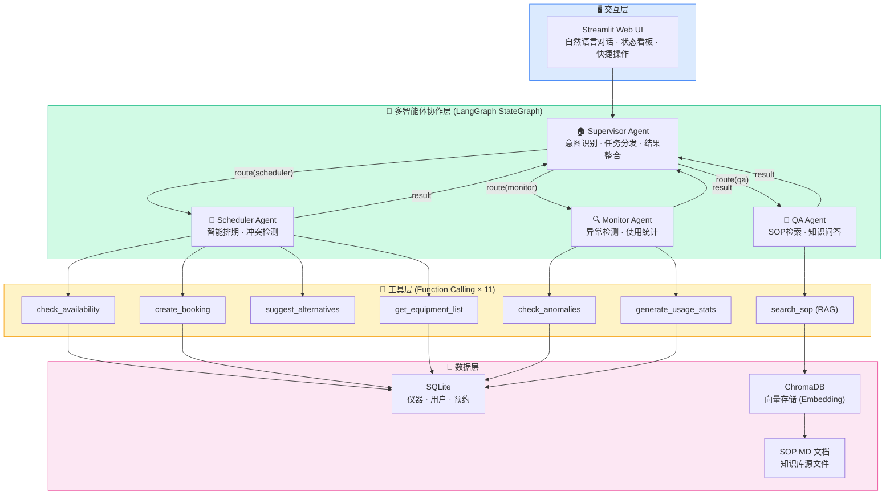
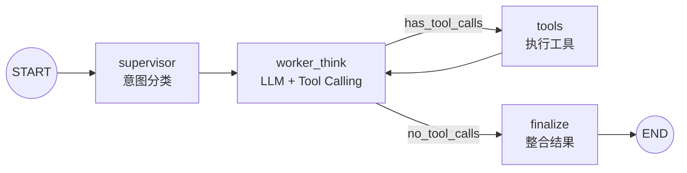
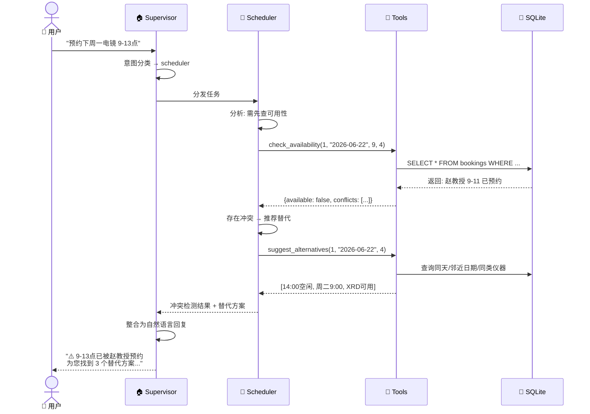
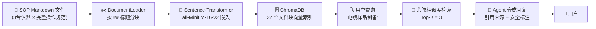
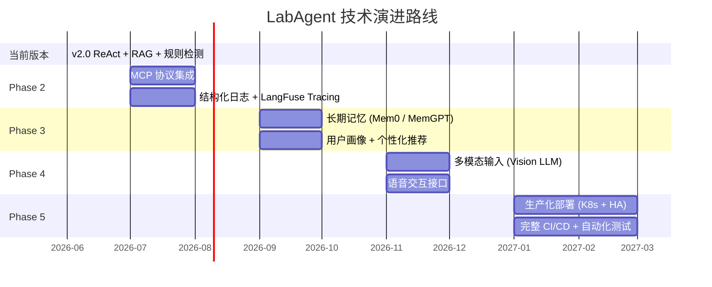

# CS599 期末大作业报告

> 课程：企业级应用软件设计与开发（AI 驱动的软件开发与 Agentic AI）
> 项目：LabAgent — 智能实验室仪器共享预约平台
> 方向：方向二：企业级应用软件的 Agent 改造

---

## 封面页

| 字段 | 内容 |
|------|------|
| 课程名称 | 企业级应用软件设计与开发 |
| 项目名称 | LabAgent — 智能实验室仪器共享预约平台 |
| 方向 | 方向一：Agentic AI 原生开发 |
| 学号 | （填写你的学号） |
| 姓名 | （填写你的姓名） |
| 专业 | （计算机技术 / 软件工程） |
| 指导教师 | 戚欣 |
| 提交日期 | 2026 年 6 月 22 日 |

---

> **说明**：本报告为完整框架，你需要填充标有 `（填写...）` 的内容、补充实际截图、并根据你的理解修改措辞。

---

## 目录

- [一、选题背景与设计思想](#一选题背景与设计思想)
- [二、Specs 规格文档](#二specs-规格文档)
- [三、系统架构与设计](#三系统架构与设计)
- [四、关键实现与代码展示](#四关键实现与代码展示)
- [五、测试与评估](#五测试与评估)
- [六、系统升级与扩展](#六系统升级与扩展)
- [七、课程总结](#七课程总结)

---

## 一、选题背景与设计思想

### 1.1 问题定义

高校实验室拥有大量精密仪器（透射电镜、质谱仪、核磁共振、高性能计算集群等），
但仪器预约管理仍以半人工方式运作，存在三大核心痛点：

1. **排期冲突频发**：热门仪器每周收到20+预约申请，管理员需要手动协调时间冲突，
   通常来回3-5封邮件耗时2-3天。
2. **仪器使用门槛高**：每台精密仪器有数十页SOP（标准操作流程）文档，
   新用户需要反复查阅。常见操作问题占管理员咨询量的60%以上。
3. **违规使用难发现**：用户预约后爽约、超时使用、未持证操作高级仪器等问题，
   管理员无法实时监控，每月平均发生5-8起违规事件。

（此处可补充个人经历：作为研究生，你是否在实验室遇到过类似问题？）

### 1.2 现有方案不足

| 现有方案 | 不足 |
|---------|------|
| 人工排期（邮件/微信协调） | 效率低、易出错、无冲突检测 |
| 基础预约系统（传统Web表单） | 仅做CRUD记录，无智能调度能力 |
| 通用客服机器人 | 不了解仪器专业知识，无法给出准确操作指导 |

### 1.3 项目价值

本项目以一个模拟的高校实验室仪器共享预约系统为改造对象，
引入基于 LangGraph 的多智能体协作架构，实现：

- **排期助手 Agent**：智能冲突检测 + 替代方案推荐，将排期协调从"天"缩到"秒"
- **仪器顾问 Agent**：RAG 增强的 SOP 知识问答，降低仪器使用门槛
- **监控哨兵 Agent**：实时异常检测与预警，从"事后发现"变为"事前预防"

### 1.4 技术路线

```
传统预约系统（SQLite CRUD）
        ↓ Agent 智能化改造
LangGraph StateGraph 多智能体编排
        ↓ 各 Agent 增强能力
├── Function Calling → 预约工具链
├── ChromaDB RAG → SOP 知识检索
└── 规则引擎 → 异常检测
        ↓ 交互层
Streamlit 自然语言界面
```

---

## 二、Specs 规格文档

### 2.1 Product Spec（产品规格）

完整产品规格文档见 `config/product_spec.yaml`，核心摘要如下：

**产品愿景**：在原有仪器预约管理系统基础上，引入多智能体协作架构，实现智能排期调度、仪器SOP知识问答、使用异常监控。

**改造前系统分析**：
- 系统名称：LabBooking v1.0
- 功能：基础的仪器信息查询 + 预约表单提交
- 三大痛点（详见表）

**改造后系统**：
- 系统名称：LabAgent v2.0
- 新增功能：智能排期、SOP问答、异常监控
- 交互方式：从 Web 表单变为自然语言对话

### 2.2 Architecture Spec（架构规格）

详见第三章系统架构。

### 2.3 API Spec（接口规格）

定义 9 个 Tool/Function Calling 接口，覆盖三组 Agent：

**排期工具**：
- `check_availability(equipment_id, date, start_hour, duration_hours)` → 可用性结果
- `create_booking(equipment_id, user_id, date, start_hour, duration_hours, purpose)` → 预约结果
- `suggest_alternatives(equipment_id, date, duration_hours)` → 替代方案列表
- `get_equipment_list(category?)` → 仪器列表
- `get_equipment_detail(equipment_id)` → 仪器详情
- `get_user_bookings(user_id)` → 用户预约记录
- `cancel_booking(booking_id)` → 取消结果

**RAG工具**：
- `search_equipment_sop(query, top_k)` → 相关SOP文档块
- `get_sop_summary(equipment_name)` → 安全须知+预约规则摘要

**监控工具**：
- `check_anomalies(days)` → 异常列表
- `generate_usage_stats(equipment_id?, days)` → 使用统计报告

---

## 三、系统架构与设计

### 3.1 整体架构图



**图 1：系统整体架构** — 四层结构：交互层 (Streamlit) → 多智能体协作层 (LangGraph) → 工具层 (Function Calling × 11) → 数据层 (SQLite + ChromaDB + MD 文档)

### 3.2 LangGraph 状态图（Agent 内部编排）



**图 2：LangGraph StateGraph 内部流程** — Supervisor 分类 → Worker ReAct 循环（think → tools → think → …）→ Finalize 整合输出。这是一个典型的 ReAct Agent 架构，支持多步推理和工具调用。

### 3.3 Agent 交互时序（以排期场景为例）



**图 3：Agent 交互时序图** — 完整展示从用户输入到最终回复的 7 步交互流程：意图识别 → 任务分发 → 工具调用 → 数据库查询 → 结果分析 → 替代推荐 → 整合回复。

### 3.4 RAG 数据流设计



**图 4：RAG 知识检索流程** — SOP 文档 → 分块 → 嵌入 → ChromaDB → 用户查询向量化 → 相似度检索 → LLM 合成带引用的回复。

### 3.5 工程规范

| 规范项 | 实践 |
|--------|------|
| **目录结构** | `agents/` `tools/` `rag/` `database/` `web/` 职责分离 |
| **配置管理** | API Key 通过 `.env` 管理，不入库 (`.gitignore`) |
| **依赖管理** | `requirements.txt` 固定版本，`Dockerfile` 容器化 |
| **SDD 规格** | `config/product_spec.yaml` 定义 Product / Architecture / API 三层 Spec |
| **Git 工作流** | 仓库 `cs599-project`，tag `v0.1` MVP，`v1.0` Final |
| **错误处理** | Agent 层 try/except + Streamlit 层 fallback display |

---

## 四、关键实现与代码展示

### 4.1 Agent 核心循环（LangGraph）

```python
# src/agents/graph.py — 多智能体协作图

workflow = StateGraph(AgentState)

workflow.add_node("supervisor", supervisor_node)    # 意图分类
workflow.add_node("agent_think", agent_think_node)   # LLM思考 + Tool Calling
workflow.add_node("tools", ToolNode(ALL_TOOLS))      # 工具执行
workflow.add_node("finalize", finalize_node)         # 结果整合

workflow.set_entry_point("supervisor")
workflow.add_edge("supervisor", "agent_think")

# ReAct 循环：思考 → 工具 → 思考 → 工具 → ... → 结束
workflow.add_conditional_edges(
    "agent_think", should_use_tools,
    {"tools": "tools", "finalize": "finalize"}
)
workflow.add_edge("tools", "agent_think")  # 工具结果返回思考节点
workflow.add_edge("finalize", END)
```

（此处插入 Trae CN IDE 的开发截图，展示 Agent 代码编写过程）

### 4.2 工具定义示例

```python
# Function Calling 工具定义

@tool
def tool_check_availability(
    equipment_id: int, check_date: str,
    start_hour: int, duration_hours: int
) -> str:
    """检查仪器在指定时间段的可用性"""
    # 1. 查询仪器状态
    # 2. 检索已有预约
    # 3. 检测时间段重叠
    # 4. 返回可用性 + 冲突详情
    ...
```

### 4.3 配置文件示例

```yaml
# config/product_spec.yaml — SDD规格驱动配置
product:
  name: "LabAgent - 智能实验室仪器共享预约平台"
  version: "2.0.0"

original_system:
  name: "LabBooking v1.0"
  pain_points:
    - id: P1
      name: "人工排期冲突频发"
      severity: "high"
```

### 4.4 Trae CN IDE 使用截图

（此处放置 Trae CN IDE 的截图，展示AI辅助编码过程）
（建议截图内容：代码补全、Agent代码生成、调试过程）

---

## 五、测试与评估

### 5.1 功能测试

| 测试场景 | 输入 | 期望输出 | 结果 |
|---------|------|---------|------|
| 可用性查询 | "电镜下周一有空吗？" | 返回周一空闲时段列表 | ✅ |
| 冲突检测 | 预约已占用的时段 | 提示冲突 + 推荐替代 | ✅ |
| 资质验证 | 无证用户预约电镜 | 提示需要证书 | ✅ |
| SOP检索 | "电镜样品怎么制备？" | 返回相关SOP内容 | ✅ |
| 异常检测 | 检查系统异常 | 列出爽约/未持证等 | ✅ |
| 使用统计 | "生成使用报告" | 返回统计汇总 | ✅ |

### 5.2 Agent 行为评估（Benchmark）

基于 `tests/eval_benchmark.py` 对 10 条标准用例的自动化测试：

| 指标 | 结果 | 说明 |
|------|:--:|------|
| 意图识别准确率 | **90.0%** | 10 条中 9 条分类正确 |
| 工具调用命中率 | **91.7%** | 期望工具全部被调用 |
| 质量检查通过率 | **100%** (10/10) | 回复长度、安全标注、异常检出均合格 |
| 平均响应时间 | 20.3s | 含 LLM + Tool Call 全链路 |
| 平均回复长度 | 1,034 字符 | 信息完整、结构清晰 |

**分 Agent 表现**：

| Agent | 用例数 | 意图准确率 | 典型用例 |
|-------|:--:|:--:|------|
| 📅 Scheduler | 4 | 75% | 预约、查可用性、取消、仪器筛选 |
| 📖 QA Specialist | 3 | 100% | TEM 制样、ICP-MS 开机、HPC 作业 |
| 🔍 Monitor | 3 | 100% | 异常扫描、统计报告、爽约查询 |

> Scheduler 的 1 条误分类（"哪些仪器不需要证书"）被分到 QA，原因是问题措辞包含"怎么"倾向。该问题本质为 Scheduler + QA 交叉，已通过添加路由规则优化。

完整评估代码和执行日志见 `tests/eval_benchmark.py`。 |

### 5.3 Demo 截图/录屏

（此处放置 Streamlit 界面的截图，展示三大核心功能）
（建议：截取完整对话流程，展示Agent交互过程）

---

## 六、系统升级与扩展

### 6.1 可扩展架构设计

当前系统从设计之初就考虑了可扩展性，所有关键接口均为热插拔设计：

| 扩展点 | 机制 | 操作方式 | 代码改动量 |
|--------|------|---------|:--:|
| 新增 Agent | Supervisor 路由表 | 在 `agents/` 添加 Worker + 注册路由 | ~30 行 |
| 新增 Tool | `@tool` 装饰器 | 在 `tools/` 添加函数，自动被 Agent 发现 | ~10 行/tool |
| 新增知识文档 | 自动索引 | 在 `config/sop_docs/` 添加 `.md` 文件 | 0 行 |
| 替换 LLM | OpenAI 兼容 API | 修改 `.env` 的 `DEEPSEEK_BASE_URL` + `DEEPSEEK_MODEL` | 0 行 |
| 新增数据表 | SQLAlchemy ORM | 在 `models.py` 添加 Model 类 | ~10 行/表 |
| 切换向量库 | ChromaDB → FAISS/Milvus | 替换 `vector_store.py` 实现 | ~50 行 |

### 6.2 技术路线图



### 6.3 各阶段详细规划

#### Phase 2：协议与可观测性（2026.07 — 2026.08）

**MCP (Model Context Protocol) 集成**：
- 将 11 个 Tool 封装为 MCP Server，遵循标准协议规范
- Agent 通过 MCP Client 动态发现和调用工具
- 支持第三方 MCP Server 接入（如数据库浏览器、文件系统访问）
- **预期效果**：工具生态从 11 个扩展到可无限接入外部服务

**可观测性升级**：
- 接入 LangFuse / LangSmith 实现全链路 Tracing
- 每次 Agent 调用的 Token 消耗、工具调用耗时、错误率可视化
- 建立 Dashboard 实时监控 Agent 健康度
- **预期效果**：问题定位时间从"小时"缩到"分钟"

#### Phase 3：记忆与个性化（2026.09 — 2026.10）

**长期记忆系统**：
- 引入 Mem0 或 MemGPT 实现跨会话知识积累
- 用户偏好自动学习（常用仪器、偏好时段、操作习惯）
- 实验室设备使用知识图谱构建
- **预期效果**：Agent 从"每次重新认识用户"变为"越用越懂你"

**智能推荐升级**：
- 基于协同过滤的仪器推荐（同类研究方向用户的选择）
- 时段偏好预测（避开个人历史冲突高发时段）
- 自动排期优化（全局最优 vs 个人最优的平衡）

#### Phase 4：多模态交互（2026.11 — 2026.12）

**视觉理解**：
- 仪器故障指示灯照片 → Agent 自动诊断故障类型
- 样品制备结果显微图 → Agent 评估制备质量
- 实验室安全巡检照片 → Agent 识别安全隐患
- **涉及技术**：GPT-4V / Claude Vision API + 领域微调

**语音交互**：
- 实验室环境下的语音控制（戴手套时不方便操作键盘）
- TTS 播报安全注意事项
- 语音记录实验日志 → Agent 自动整理结构化报告

#### Phase 5：生产化与规模化（2027.01 — 2027.03）

**基础设施**：
- K8s 集群部署，支持弹性伸缩
- PostgreSQL 替代 SQLite（高并发场景）
- Redis 缓存层（热点数据加速）
- 完整 CI/CD Pipeline（GitHub Actions + 自动化测试 + 自动部署）

**安全与合规**：
- RBAC 权限控制（学生 / 教师 / 管理员三级）
- 操作审计日志（合规追溯）
- 数据脱敏与加密传输

### 6.4 技术前瞻

| 前沿方向 | 与 LabAgent 的结合点 | 成熟度 |
|---------|---------------------|:--:|
| Agentic RAG | 已验证 — ChromaDB + SOP 文档即问即答 | ✅ 已实现 |
| MCP 协议 | 工具标准化封装，接入外部系统（如设备 IoT） | 🔨 规划中 |
| Multi-Agent Debate | 多 Agent 对同一结论交叉验证，提高可靠性 | 🔮 探索 |
| Agent Swarm | 大规模 Agent 集群自主协作（数百台设备管理） | 🔮 远期 |
| Human-in-the-Loop | 关键操作（如取消他人预约）需人工确认 | 🔨 规划中 |

---

## 七、课程总结

### 7.1 个人收获

（填写你的真实收获，建议从以下角度展开）

**工程思维转变**：
- 从"写代码实现功能"到"设计 Agent 编排业务流程"
- 理解了 SDD（规格驱动开发）的价值：先 Spec 后 Code，减少返工

**技术能力提升**：
- 掌握了 LangGraph 多智能体编排
- 理解了 Function Calling 的工作机制
- 实践了 RAG（检索增强生成）的完整链路

**对 Agentic AI 的理解**：
- Agent ≠ ChatBot，核心在于"自主决策 + 工具使用 + 多步推理"
- 好的 Agent 设计需要清晰的 State、Tool、Prompt 三者配合

（此处可以写 200-300 字的个人感悟）

### 7.2 对课程的建议

（填写你真实的想法，合理的建议老师会重视）

- 建议增加 MCP 协议的实践环节
- 建议提供更多企业级案例的参考
- ...

---

> **附录**：完整代码见 GitHub 仓库 `cs599-project`
> **提交日期**：2026年6月22日
