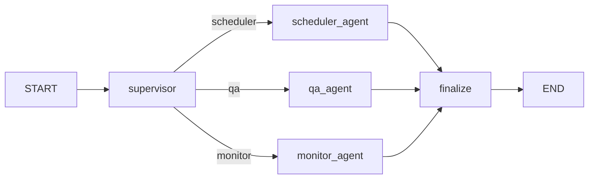
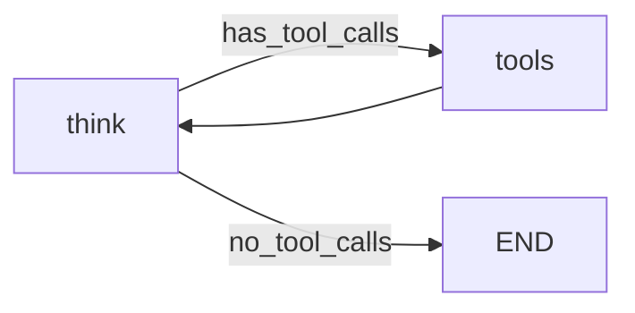

# LabAgent 详细架构说明

## 一、系统总览

LabAgent 是一个基于 LangGraph 的 Supervisor-Worker 多智能体协作系统，
专注于高校实验室仪器共享预约的智能化管理。

```
用户 → Streamlit UI → Chat API → LangGraph 主图
                                       │
                          ┌────────────┼────────────┐
                          ↓            ↓            ↓
                     Scheduler      QA Agent     Monitor
                     (ReAct × N)   (ReAct × N)  (ReAct × N)
                          │            │            │
                          └────────────┼────────────┘
                                       ↓
                                   Supervisor
                                   (整合结果)
                                       ↓
                                    用户
```

## 二、多智能体架构

### 2.1 Supervisor Agent（管家）
- **职责**：意图分类、任务分发、结果整合
- **LLM**：DeepSeek-Chat，temperature=0
- **输入**：用户消息 + 对话历史（最近6条）+ 用户上下文
- **输出**：JSON `{primary: "scheduler|qa|monitor"}`
- **分类逻辑**：LLM 分类 + 关键词 fallback（预约/操作/异常等）

### 2.2 Worker Agent 子图
每个 Worker 是独立的 LangGraph StateGraph（编译后的子图），拥有：
- 专属 System Prompt（业务领域知识）
- 专属工具集（通过 MCP 协议动态发现）
- 独立的 ReAct 循环（think → tools → think → ... → done）
- 最大步数限制：8 步（防止无限循环）

#### Scheduler Agent（排期专家）
- 工具：get_equipment_list, get_equipment_detail, check_availability,
  create_booking, suggest_alternatives, get_user_bookings, cancel_booking
- 核心流程：逐步引导预约（仪器→时间→检测→确认→创建）
- 规则：先检查后承诺、冲突即机会、主动校验证书

#### QA Agent（仪器顾问）
- 工具：search_equipment_sop, get_sop_summary, get_equipment_detail
- RAG 知识库：5 台仪器的完整 SOP 文档（34 文档块）
- 规则：必须检索后回答、标注来源、安全第一、不会就说不会

#### Monitor Agent（监控哨兵）
- 工具：check_anomalies, generate_usage_stats, get_safety_incidents
- 检测维度：爽约、未持证操作、高频预约、超时使用
- 安全事件库：7 条真实实验室事故案例（引用自公开报道）

## 三、LangGraph 状态图

### 3.1 主图结构



### 3.2 子 Agent 内部 ReAct 循环



### 3.3 Agent State

```python
class AgentState(TypedDict):
    messages: List[BaseMessage]       # 对话历史（含 System/Human/AI/Tool）
    intent: str                       # scheduler / qa / monitor
    active_agents: List[str]          # 需调用的 Agent 列表
    user_context: str                 # 当前用户信息（ID、证书、角色）
    agent_trace: List[dict]           # 追踪日志（去重，最多60条）
    scheduler_result: str             # 排期专家结果
    qa_result: str                    # 顾问结果
    monitor_result: str               # 监控结果
    final_response: str               # 最终回复
```

## 四、工具体系

### 4.1 Function Calling（12 个工具）

| 工具 | 所属 | 功能 |
|:--|:--|:--|
| get_equipment_list | Scheduler | 获取仪器列表（支持类别过滤） |
| get_equipment_detail | Scheduler/QA | 获取仪器详情（位置/证书/费用） |
| check_availability | Scheduler | 检查时段可用性 |
| create_booking | Scheduler | 创建预约（含冲突+证书验证） |
| suggest_alternatives | Scheduler | 推荐替代方案 |
| get_user_bookings | Scheduler | 查询用户预约记录 |
| cancel_booking | Scheduler | 取消预约 |
| search_equipment_sop | QA | RAG 语义检索 SOP 文档 |
| get_sop_summary | QA | 提取 SOP 安全须知+规则 |
| check_anomalies | Monitor | 异常检测（爽约/未持证/高频） |
| generate_usage_stats | Monitor | 使用统计报告 |
| get_safety_incidents | Monitor | 安全事故案例检索 |

### 4.2 MCP 协议

所有 12 个工具同时通过 MCP (Model Context Protocol) 暴露：

- **MCP Server**（`src/mcp/lab_server.py`）：FastMCP，支持 stdio/SSE 双协议
- **MCP Client**（`src/mcp/mcp_client.py`）：运行时发现工具，动态转换为 LangChain Tool
- **Agent 集成**：`_init_mcp_tools()` 在 Agent 初始化时连接 MCP Server，
  工具通过 MCP 加载（Scheduler:7, QA:2, Monitor:3）
- **容错**：MCP 不可用时自动回退到内置 Function Calling

## 五、RAG 知识库（Agentic RAG）

### 5.1 文档处理流水线

```
SOP Markdown (.md)
    ↓ DocumentLoader（按 ## 标题分块）
文本块 (34 chunks)
    ↓ Sentence-Transformer (all-MiniLM-L6-v2)
向量嵌入 (384维)
    ↓ ChromaDB 持久化
向量索引
    ↓ 用户查询 → 向量化 → 余弦相似度
Top-K 检索结果 (K=3)
    ↓ Agent 合成 + 来源引用
最终回复
```

### 5.2 SOP 文档列表

| 文档 | 行数 | 涵盖内容 |
|:--|:--|:--|
| electron_microscope.md | 102 | TEM 样品制备、操作流程、安全事项 |
| mass_spectrometer.md | 109 | ICP-MS 前处理、调谐、关机流程 |
| hpc_cluster.md | 125 | HPC 作业提交、分区选择、软件环境 |
| xrd_diffractometer.md | 98 | XRD 样品制备、参数设置、辐射安全 |
| nmr_spectrometer.md | 112 | NMR 配制、锁场匀场、超导安全 |

## 六、数据库设计

### 6.1 ER 模型

```
users (用户)
  id, name, role(学生/教师/管理员), cert_level(0/1/2), email, department

equipment (仪器)
  id, name, category, location, requires_cert, cert_level_required,
  max_hours_per_booking, hourly_cost, status(可用/维护中/报废)

bookings (预约)
  id, equipment_id(FK), user_id(FK), booking_date, start_hour,
  duration_hours, purpose, status(已确认/已完成/已取消/爽约)
```

### 6.2 约束

```sql
CHECK (start_hour >= 0 AND start_hour < 24)
CHECK (duration_hours >= 1 AND duration_hours <= 24)
```

### 6.3 种子数据

18 条预约记录覆盖 5 台仪器、5 个用户、今天至未来 4 天，
含 2 条违规记录（爽约 + 未持证）。

## 七、前端架构

### 7.1 页面结构

```
Streamlit Wide Layout
├── 侧边栏
│   ├── 实时时钟 (JS)
│   ├── 用户切换 (5人)
│   ├── 仪器状态 (实时指示灯)
│   ├── 今日概览 (可展开详情)
│   ├── 活跃告警 (可跳转)
│   └── 系统状态
├── 导航 Tab
│   ├── 💬 AI 助手 (多轮对话 + 快捷操作)
│   ├── 📅 预约管理 (周历 + 甘特图 + 快速预约)
│   ├── 🔍 监控中心 (KPI + 异常 + 统计 + 安全案例)
│   └── 📖 知识库 (RAG 检索 + 文档浏览 + 上传)
└── 底部
    └── CS599 信息
```

### 7.2 交互特性
- 点击日历空格 → 多选时段 → 内联 AI 对话窗口
- 预约成功实时刷新日历/甘特图
- 聊天历史按用户隔离持久化
- 对话导出 Markdown
- 异常报告下载

## 八、部署架构

### 8.1 本地部署

```bash
pip install -r requirements.txt
cp .env.example .env  # 填入 DEEPSEEK_API_KEY
streamlit run src/web/app.py
```

### 8.2 Docker 部署

```dockerfile
FROM python:3.11-slim
COPY requirements.txt .
RUN pip install -r requirements.txt
COPY src/ src/ && COPY config/ config/
EXPOSE 8501
CMD ["streamlit", "run", "src/web/app.py", "--server.address=0.0.0.0"]
```

### 8.3 云部署（Streamlit Cloud）
- 仓库：GitHub `cs599-project`（Public）
- 主文件：`src/web/app.py`
- Secrets：`DEEPSEEK_API_KEY`, `DEEPSEEK_BASE_URL`
- URL：`https://xxx.streamlit.app`

## 九、SDD 规格驱动

`config/product_spec.yaml` 定义三层规格：

| 层级 | 内容 |
|:--|:--|
| Product Spec | 原始系统痛点、Agent 改造方案、数据模型 |
| Architecture Spec | Supervisor-Worker 架构、Agent 交互流程 |
| API Spec | 12 个工具的定义、参数、返回值 |

`src/spec_loader.py` 运行时读取 Spec，驱动预约验证规则。

## 十、评估基准

`tests/eval_benchmark.py` 定义 10 条标准测试用例：

| 指标 | 结果 |
|:--|:--|
| 意图识别准确率 | 90.0% (9/10) |
| 工具调用命中率 | 91.7% |
| 质量检查通过率 | 100% (10/10) |
| 平均响应时间 | 20.3 秒 |

## 十一、技术栈汇总

| 层级 | 技术 |
|:--|:--|
| AI IDE | VS Code |
| LLM | DeepSeek-Chat (`deepseek-chat`) |
| Agent 框架 | LangGraph 0.2+ |
| LLM 接口 | LangChain + OpenAI 兼容 API |
| RAG | ChromaDB 0.5 + Sentence-Transformers |
| 协议 | Function Calling + MCP |
| 数据库 | SQLite 3 + SQLAlchemy 2.0 |
| UI | Streamlit 1.58 |
| 可视化 | Pandas + Streamlit Charts |
| 容器 | Docker |
| 语言 | Python 3.11 |

---

> **版本**：v1.0
> **提交日期**：2026-06-22
> **作者**：saihara
